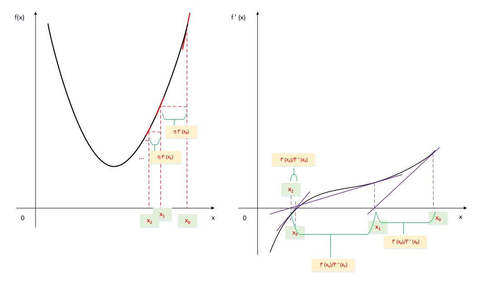
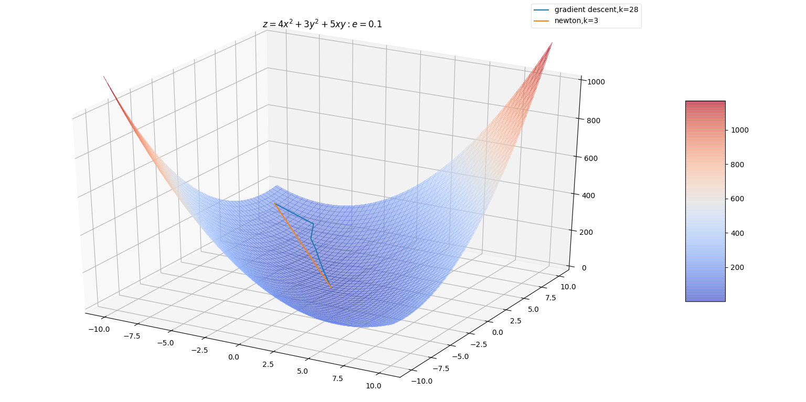

# 数值计算基础

[TOC]
## 一、数值稳定性

### 近似误差
在计算机中执行数学运算需要使用有限的比特位来表达实数，这会引入近似误差

近似误差可以在多步数值运算中传递、积累，从而导致理论上成功的算法失败
数值算法设计时要考虑将累计误差最小化
上溢出overflow和下溢出underflow：

一种严重的误差是下溢出：当接近零的数字四舍五入为零时，发生下溢出

许多函数在参数为零和参数为一个非常小的正数时，行为是不同的。如对数函数要求自变量大于零；除法中要求除数非零。
另一种严重的误差是上溢出：当数值非常大，超过了计算机的表示范围时，发生上溢出。
### softmax 函数
1. 一个数值稳定性的例子是softmax函数。

设 $\vec{\mathbf{x}}=(x_{1},x_{2},\cdots,x_{n})^{\mathrm{T}}$ ，则softmax函数定义为：
$$
\mathrm{softmax}(\vec{\mathbf{x}})=\left(\frac{\exp (x_{1})}{\sum_{j=1}^{n}\exp(x_{j})},\frac{\exp (x_{2})}{\sum_{j=1}^{n}\exp(x_{j})},\cdots,\frac{\exp (x_{n})}{\sum_{j=1}^{n}\exp(x_{j})}\right)^{\mathrm{T}}
$$
当所有的 $x_{i}$ 都等于常数 $c$ 时，softmax函数的每个分量的理论值都为 $\frac{1}{n}$
* 考虑 $c$ 是一个非常大的负数（比如趋近负无穷），此时 $\exp(c)$ 下溢出。此时 $\frac{\exp(c)}{\sum_{j=1}^{n}\exp(c)}$ 分母为零，结果未定义。
* 考虑 $c$ 是一个非常大的正数（比如趋近正无穷），此时 $\exp(c)$ 上溢出。  $\frac{\exp(c)}{\sum_{j=1}^{n}\exp(c)}$  的结果未定义。
2. 解决的办法是：令 $\vec{\mathbf{z}}=\vec{\mathbf{x}}-\max_{i} x_{i}$ ，则有 $\mathrm{softmax}(\vec{\mathbf{z}})$ 的第 $i$ 个分量为：
$$
\mathrm{softmax}(\vec{\mathbf{z}})_{i}=\frac{\exp(z_{i})}{\sum_{j=1}^{n}\exp(z_{j})}=\frac{\exp(\max_{k}x_{k})\exp(z_{i})}{\exp(\max_{k}x_{k})\sum_{j=1}^{n}\exp(z_{j})}\\
=\frac{\exp(z_{i}+\max_{k}x_{k})}{\sum_{j=1}^{n}\exp(z_{j}+\max_{k}x_{k})}\\
=\frac{\exp(x_{i})}{\sum_{j=1}^{n}\exp(x_{j})}=\mathrm{softmax}(\vec{\mathbf{x}})_{i}
$$
* 当 $\vec{\mathbf{x}}$  的分量较小时， $\vec{\mathbf{z}}$ 的分量至少有一个为零，从而导致 $\mathrm{softmax}(\vec{\mathbf{z}})$ 的分母至少有一项为 1，从而解决了下溢出的问题。
* 当  $\vec{\mathbf{x}}$  的分量较大时，$\mathrm{softmax}(\vec{\mathbf{z}})_{i}$ 相当于分子分母同时除以一个非常大的数  $\exp(\max_{i}x_{i})$ ，从而解决了上溢出。
3. 还有个问题：当 $\vec{\mathbf{x}}$ 的分量较小时， $\mathrm{softmax}(\vec{\mathbf{x}})$ 的计算结果可能为 0 。

* 此时 $\log\mathrm{softmax}(\vec{\mathbf{x}})$ 趋向于负无穷，非数值稳定的。因此需要设计专门的函数来计算 $\log \mathrm{softmax}$ ，而不是将 $\mathrm{softmax}$ 的结果传递给 $\log$ 函数。

* 通常将 $\mathrm{softmax}$ 函数的输出作为模型的输出。由于一般使用样本的交叉熵作为目标函数，因此需要用到 $\mathrm{softmax}$ 输出的对数。

4. 当从头开始实现一个数值算法时，需要考虑数值稳定性。

当使用现有的数值计算库时，不需要考虑数值稳定性。

5. softmax 名字的来源是hardmax。

hardmax 把一个向量 $\vec{\mathbf{x}}$ 映射成向量 $(0,\cdots,0,1,0,\cdots,0)^{\mathrm{T}}$ 。即：$\vec{\mathbf{x}}$ 最大元素的位置填充1，其它位置填充0。

softmax 会在这些位置填充0.0~1.0 之间的值（如：某个概率值）。

## 二、Conditioning
1. Conditioning刻画了一个函数的如下特性：当函数的输入发生了微小的变化时，函数的输出的变化有多大。

* 对于Conditioning较大的函数，在数值计算中可能有问题。因为函数输入的舍入误差可能导致函数输出的较大变化。
2. 对于方阵 $\mathbf{A}\in\mathbb{R}^{n\times n}$ ，其条件数condition number为：
$$
\mathrm{condition\ number}=\max_{1\leq i,j\leq n,i\neq j}\left|\frac{\lambda_{i}}{\lambda_{j}}\right|
$$
其中 $\lambda_{i},i=1,2,\cdots,n$ 为 $\mathbf{A}$ 的特征值。

* 方阵的条件数就是最大的特征值除以最小的特征值。
* 当方阵的条件数很大时，矩阵的求逆将对误差特别敏感（即：$\mathbf{A}$  的一个很小的扰动，将导致其逆矩阵一个非常明显的变化）。
条件数是矩阵本身的特性，它会放大那些包含矩阵求逆运算过程中的误差。

## 三、梯度下降法

1. 梯度下降法是求解无约束最优化问题的一种常见方法，优点是实现简单

2. 对于函数：$f:\mathbb{R}^{n}\to\mathbb{R}$ ，输入为多维的。假设输入 $\vec{\mathbf{x}}=(x_{1},x_{2},\cdots,x_{n})^{\mathrm{T}}$ ，则定义梯度：
$$
\nabla_{\vec{\mathbf{x}}}f(\vec{\mathbf{x}})=\left(\frac{\partial}{\partial x_{1}}f(\vec{\mathbf{x}}),\frac{\partial}{\partial x_{2}}f(\vec{\mathbf{x}}),\cdots,\frac{\partial}{\partial x_{n}}f(\vec{\mathbf{x}})\right)^{\mathrm{T}}
$$
驻点满足：$\nabla_{\vec{\mathbf{x}}}f(\vec{\mathbf{x}})=\vec{\mathbf{0}}$ 
3. 沿着方向 $\vec{\mathbf{u}}$ 的方向导数directional derivative定义为：
$$
\lim_{\alpha\to 0}\frac{f(\vec{\mathbf{x}}+\alpha\vec{\mathbf{u}})-f(\vec{\mathbf{x}})}{\alpha}
$$
其中 $\vec{\mathbf{u}}$ 为单位向量。

方向导数就是 $\frac{\partial}{\partial\alpha}f(\vec{\mathbf{x}}+\alpha\vec{\mathbf{u}})$ 。根据链式法则，它也等于 $\vec{\mathbf{u}}^{\mathrm{T}}\nabla_{\vec{\mathbf{x}}}f(\vec{\mathbf{x}})$
3. 为了最小化 $f$ ，则寻找一个方向：沿着该方向，函数值减少的速度最快（换句话说，就是增加最慢）。即：
$$
\min_{\vec{\mathbf{u}}}\vec{\mathbf{u}}^{\mathrm{T}}\nabla_{\vec{\mathbf{x}}}f(\vec{\mathbf{x}})\\
s.t.\ || \vec{\mathbf{u}}||_{2}=1
$$
* 假设 $\vec{\mathbf{u}}$ 与梯度的夹角为 $\theta$ ，则目标函数等于：
$$
||\vec{\mathbf{u}}||_{2}||\nabla_{\vec{\mathbf{x}}}f(\vec{\mathbf{x}})||_{2}\cos\theta
$$
考虑到 $||\vec{\mathbf{u}}||_{2}=1$ ，以及梯度的大小与 $\theta$ 无关，于是上述问题转化为：
$$
\min_{\theta}\cos\theta
$$
于是：$\theta^{*}=\pi$ ，即 $\vec{\mathbf{u}}$ 沿着梯度的相反的方向。
即：梯度的方向是函数值增加最快的方向，梯度的相反方向是函数值减小的最快的方向。

* 可以沿着负梯度的方向来降低 $f$ 的值，这就是梯度下降法。

4. 根据梯度下降法，为了寻找 $f$ 的最小点，迭代过程为：
$$
\vec{\mathbf{x}}'=\vec{\mathbf{x}}-\epsilon\nabla_{\vec{\mathbf{x}}}f(\vec{\mathbf{x}})
$$
迭代结束条件为：梯度向量 $\nabla_{\vec{\mathbf{x}}}f(\vec{\mathbf{x}})$ 的每个成分为零或者非常接近零。

* $\epsilon$ 为学习率，它是一个正数，决定了迭代的步长。
5. 选择学习率有多种方法：

* 一种方法是：选择 $\epsilon$ 为一个小的、正的常数

* 另一种方法是：给定多个 $\epsilon$ ，然后选择使得 $f(\vec{\mathbf{x}}-\epsilon\nabla_{\vec{\mathbf{x}}}f(\vec{\mathbf{x}}))$ 最小的那个值作为本次迭代的学习率（即：选择一个使得目标函数下降最大的学习率）。这种做法叫做线性搜索line search

* 第三种方法是：求得使 $f(\vec{\mathbf{x}}-\epsilon\nabla_{\vec{\mathbf{x}}}f(\vec{\mathbf{x}}))$ 取极小值的 $\epsilon$ ，即求解最优化问题：
$$
\epsilon^{*}=\arg\min_{\epsilon,\epsilon>0}f(\vec{\mathbf{x}}-\epsilon\nabla_{\vec{\mathbf{x}}}f(\vec{\mathbf{x}}))
$$
这种方法也称作最速下降法。
​    * 在最速下降法中，假设相邻的三个迭代点分别为：$\vec{\mathbf{x}}^{<k>},\vec{\mathbf{x}}^{<k+1>},\vec{\mathbf{x}}^{<k+2>}$ ，可以证明：$(\vec{\mathbf{x}}^{<k+1>}-\vec{\mathbf{x}}^{<k>})\cdot(\vec{\mathbf{x}}^{<k+2>}-\vec{\mathbf{x}}^{<k+1>})=0$ 。即相邻的两次搜索的方向是正交的！
证明：
$$
\vec{\mathbf{x}}^{<k+1>}=\vec{\mathbf{x}}^{<k>}-\epsilon^{<k>}\nabla_{\vec{\mathbf{x}}}f(\vec{\mathbf{x}}^{<k>})\\
\vec{\mathbf{x}}^{<k+2>}=\vec{\mathbf{x}}^{<k+1>}-\epsilon^{<k+1>}\nabla_{\vec{\mathbf{x}}}f(\vec{\mathbf{x}}^{<k+1>})
$$
根据最优化问题，有：
$$
\epsilon^{<k+1>}=\arg\min_{\epsilon,\epsilon>0}f(\vec{\mathbf{x}}^{<k+1>}-\epsilon\nabla_{\vec{\mathbf{x}}}f(\vec{\mathbf{x}}^{<k+1>}))\\
\to \frac{\partial f(\vec{\mathbf{x}}^{<k+1>}-\epsilon\nabla_{\vec{\mathbf{x}}}f(\vec{\mathbf{x}}^{<k+1>}))}{\partial\epsilon}|_{\epsilon=\epsilon^{<k+1>}}=0\\
\to\nabla_{\vec{\mathbf{x}}}f(\vec{\mathbf{x}}^{<k+2>})\cdot\nabla_{\vec{\mathbf{x}}}f(\vec{\mathbf{x}}^{<k+1>})=0\\
\to(\vec{\mathbf{x}}^{<k+1>}-\vec{\mathbf{x}}^{<k>})\cdot(\vec{\mathbf{x}}^{<k+2>}-\vec{\mathbf{x}}^{<k+1>})=0
$$
* 此时迭代的路线是锯齿形的，因此收敛速度较慢

6. 某些情况下如果梯度向量 $\nabla_{\vec{\mathbf{x}}}f(\vec{\mathbf{x}})$ 的形式比较简单，则可以直接求解方程：
$$
\nabla_{\vec{\mathbf{x}}}f(\vec{\mathbf{x}})=\vec{\mathbf{0}}
$$
* 此时不用任何迭代，直接获得解析解。
7. 梯度下降算法：

* 输入：
    * 目标函数 $f(\vec{\mathbf{x}})$
    * 梯度函数 $g(\vec{\mathbf{x}})=\nabla f(\vec{\mathbf{x}})$ 
    * 计算精度 $e$
* 输出： $f(\vec{\mathbf{x}})$ 的极小点 $\vec{\mathbf{x}}^{*}$
* 算法步骤：
    * 选取初始值 $\vec{\mathbf{x}}^{<0>}\in\mathbb{R}^{n}$ , 置 $k=0$
    * 计算 $f(\vec{\mathbf{x}}^{<k>})$ 
    * 计算梯度 $\vec{\mathbf{g}}_{k}=g(\vec{\mathbf{x}}^{<k>})$
        * 若梯度 $|\vec{\mathbf{g}}_{k}|<e$ ，则停止迭代, $\vec{\mathbf{x}}^{*}=\vec{\mathbf{x}}$
            * 即此时导数为 0
        * 若梯度 $|\vec{\mathbf{g}}_{k}|\geq e$ ，则令 $\vec{\mathbf{p}}_{k}=-\vec{\mathbf{g}}_{k}$ ，求 $\epsilon_{k}$ ：$\epsilon_{k}=\min_{\epsilon\leq0}f(\vec{\mathbf{x}}^{<k>}+\epsilon\vec{\mathbf{p}}_{k})$
            * 通常这也是个最小化问题。但是可以给定一系列的的值：如[10,1,0.1,0.01,0.001,0.0001]然后从中挑选
        * 令 $\vec{\mathbf{x}}^{<k+1>}=\vec{\mathbf{x}}^{<k>}+\epsilon_{k}\vec{\mathbf{p}}_{k}$ ，计算 $f(\vec{\mathbf{x}}^{<k+1>})$ 
            * 若 $|f(\vec{\mathbf{x}}^{<k+1>}-\vec{\mathbf{x}}^{<k>})|<e$ 或者 $|\vec{\mathbf{x}}^{<k+1>}-\vec{\mathbf{x}}^{<k>}|<e$ 时，停止迭代，$\vec{\mathbf{x}}^{*}=\vec{\mathbf{x}}$
            * 否则，令 $k=k+1$  ，计算梯度 $\vec{\mathbf{g}}_{k}=g(\vec{\mathbf{x}}^{<k>})$ 继续迭代

8. 当目标函数是凸函数时，梯度下降法的解是全局最优的。

* 通常情况下，梯度下降法的解不保证是全局最优的
* 梯度下降法的收敛速度未必是最快的

## 四、海森矩阵
### 二阶导数
1. 二阶导数 $f''(x)$ 刻画了曲率。假设有一个二次函数（实际任务中，很多函数不是二次的，但是在局部可以近似为二次函数）：
* 如果函数的二阶导数为零，则它是一条直线。如果梯度为 1，则当沿着负梯度的步长为 $\epsilon$ 时，函数值减少 $\epsilon$ 
* 如果函数的二阶导数为负，则函数向下弯曲。如果梯度为1，则当沿着负梯度的步长为 $\epsilon$ 时，函数值减少的量大于 $\epsilon$ 
* 如果函数的二阶导数为正，则函数向上弯曲。如果梯度为1，则当沿着负梯度的步长为 $\epsilon$ 时，函数值减少的量少于 $\epsilon$ 

### 海森矩阵
1. 当函数输入为多维时，定义海森矩阵：
$$
\mathbf{H}(f)(\vec{\mathbf{x}})=\left[
    \begin{matrix}
        \frac{\partial^{2}}{\partial x_{1}\partial x_{1}}f & \frac{\partial^{2}}{\partial x_{1}\partial x_{2}}f & \cdots & \frac{\partial^{2}}{\partial x_{1}\partial x_{n}}f \\
        \frac{\partial^{2}}{\partial x_{2}\partial x_{1}}f & \frac{\partial^{2}}{\partial x_{2}\partial x_{2}}f & \cdots & \frac{\partial^{2}}{\partial x_{2}\partial x_{n}}f \\
        \vdots & \vdots & \ddots & \vdots \\
        \frac{\partial^{2}}{\partial x_{n}\partial x_{1}}f & \frac{\partial^{2}}{\partial x_{n}\partial x_{2}}f & \cdots & \frac{\partial^{2}}{\partial x_{n}\partial x_{n}}f \\
    \end{matrix}
    \right]
$$
即海森矩阵的第 $i$ 行 $j$ 列元素为：
$$
\mathbf{H}_{i,j}=\frac{\partial^{2}}{\partial x_{i} \partial x_{j}}f(\vec{\mathbf{x}})
$$
* 当二阶偏导是连续时，海森矩阵是对称阵，即有：$\mathbf{H}=\mathbf{H}^{\mathrm{T}}$ 
    * 在深度学习中大多数海森矩阵都是对称阵

2. 对于特定方向 $\vec{\mathbf{d}}$ 上的二阶导数为：
$$
\vec{\mathbf{d}}^{\mathrm{T}}\mathbf{H}\vec{\mathbf{d}}
$$
* 如果 $\vec{\mathbf{d}}$  是海森矩阵的特征向量，则该方向的二阶导数就是对应的特征值
* 如果 $\vec{\mathbf{d}}$ 不是海森矩阵的特征向量，则该方向的二阶导数就是所有特征值的加权平均，权重在 (0,1)之间。且与 $\vec{\mathbf{d}}$ 夹角越小的特征向量对应的特征值具有更大的权重。
* 最大特征值确定了最大二阶导数，最小特征值确定最小二阶导数
### 海森矩阵与学习率
1. 将 $f(\vec{\mathbf{x}})$ 在 $\vec{\mathbf{x}}_{0}$ 处泰勒展开：
$$
f(\vec{\mathbf{x}})\approx f(\vec{\mathbf{x}}_{0})+(\vec{\mathbf{x}}-\vec{\mathbf{x}}_{0})^{\mathrm{T}}\vec{\mathbf{g}}+\frac{1}{2}(\vec{\mathbf{x}}-\vec{\mathbf{x}}_{0})^{\mathrm{T}}\mathbf{H}(\vec{\mathbf{x}}-\vec{\mathbf{x}}_{0})
$$
其中 $\vec{\mathbf{g}}$ 为 $\vec{\mathbf{x}}_{0}$ 处的梯度； $\mathbf{H}$ 为 $\vec{\mathbf{x}}_{0}$ 处的海森矩阵。

根据梯度下降法：
$$
\vec{\mathbf{x}}'=\vec{\mathbf{x}}-\epsilon\nabla_{\vec{\mathbf{x}}}f(\vec{\mathbf{x}})
$$
应用在点 $\vec{\mathbf{x}}_{0}$ ，有：
$$
f(\vec{\mathbf{x}}_{0}-\epsilon\vec{\mathbf{g}})\approx f(\vec{\mathbf{x}}_{0})-\epsilon\vec{\mathbf{g}}^{\mathrm{T}}\vec{\mathbf{g}}+\frac{1}{2}\epsilon^{2}\vec{\mathbf{g}}^{\mathrm{T}}\mathbf{H}\vec{\mathbf{g}}
$$
* 第一项代表函数在点 $\vec{\mathbf{x}}_{0}$ 处的值
* 第二项代表由于斜率的存在，导致函数值的变化
* 第三项代表由于曲率的存在，对于函数值变化的矫正
2. 注意：如果 $\frac{1}{2}\epsilon^{2}\vec{\mathbf{g}}^{\mathrm{T}}\mathbf{H}\vec{\mathbf{g}}$ 较大，则很有可能导致：沿着负梯度的方向，函数值反而增加！

* 如果 $\vec{\mathbf{g}}^{\mathrm{T}}\mathbf{H}\vec{\mathbf{g}}\leq0$ ，则无论 $\epsilon$ 取多大的值， 可以保证函数值是减小的

* 如果  $\vec{\mathbf{g}}^{\mathrm{T}}\mathbf{H}\vec{\mathbf{g}}>0$ ， 则学习率 $\epsilon$ 不能太大。若 $\epsilon$ 太大则函数值增加

    * 根据 $f(\vec{\mathbf{x}}_{0}-\epsilon\vec{\mathbf{g}})-f(\vec{\mathbf{x}}_{0})<0$ 有：
$$
\epsilon<\frac{2\vec{\mathbf{g}}^{\mathrm{T}}\vec{\mathbf{g}}}{\vec{\mathbf{g}}^{\mathrm{T}}\mathbf{H}\vec{\mathbf{g}}}
$$
考虑最速下降法，选择使得 $f$ 下降最快的 $\epsilon$ ，则有：
$$
\epsilon^{*}=\arg\min_{\epsilon,\epsilon>0}f(\vec{\mathbf{x}}_{0}-\epsilon\vec{\mathbf{g}})
$$
求解 $\frac{\partial}{\partial\epsilon}f(\vec{\mathbf{x}}_{0}-\epsilon\vec{\mathbf{g}})=0$ 有：
$$
\epsilon^{*}=\frac{\vec{\mathbf{g}}^{\mathrm{T}}\vec{\mathbf{g}}}{\vec{\mathbf{g}}^{\mathrm{T}}\mathbf{H}\vec{\mathbf{g}}}
$$
        >根据 $\vec{\mathbf{g}}^{\mathrm{T}}\mathbf{H}\vec{\mathbf{g}}>0$ ，很明显有：$\epsilon^{*}<\frac{2\vec{\mathbf{g}}^{\mathrm{T}}\vec{\mathbf{g}}}{\vec{\mathbf{g}}^{\mathrm{T}}\mathbf{H}\vec{\mathbf{g}}}$ 
3. 由于海森矩阵为实对称阵，因此它可以进行特征值分解。

假设其特征值从大到小排列为：
$$
\lambda_{1},\lambda_{2},\cdots,\lambda_{n}
$$
其瑞利商为 $R(\vec{\mathbf{x}})=\frac{\vec{\mathbf{x}}^{\mathrm{T}}\mathbf{H}\vec{\mathbf{x}}}{\vec{\mathbf{x}}^{\mathrm{T}}\vec{\mathbf{x}}},\vec{\mathbf{x}}\neq0$ ，可以证明：
$$
\lambda_{n}\leq R(\vec{\mathbf{x}})\leq \lambda_{1} \\
\lambda_{1}=\max_{\vec{\mathbf{x}}\neq0}R(\vec{\mathbf{x}}) \\
\lambda_{n}=\min_{\vec{\mathbf{x}}\neq0}R(\vec{\mathbf{x}})
$$
根据：
$$
\epsilon^{*}=\frac{\vec{\mathbf{g}}^{\mathrm{T}}\vec{\mathbf{g}}}{\vec{\mathbf{g}}^{\mathrm{T}}\mathbf{H}\vec{\mathbf{g}}}=\frac{1}{R(\vec{\mathbf{g}})}
$$
可知海森矩阵决定了学习率的取值范围。

* 最坏的情况下，梯度 $\vec{\mathbf{g}}$ 与海森矩阵最大特征值 $\lambda_{1}$ 对应的特征向量平行，则此时最优学习率为 $\frac{1}{\lambda_{1}}$

### 驻点与全局极小点
1. 满足导数为零的点（即 $f'(x)=0$ ）称作驻点。驻点可能为下面三种类型之一：

* 局部极小点：在 $x$ 的一个邻域内，该点的值最小
* 局部极大点：在 $x$ 的一个邻域内，该点的值最大
* 鞍点：既不是局部极小，也不是局部极大

2. 全局极小点：$x^{*}=\arg\min_{x}f(x)$ 。

* 全局极小点可能有一个或者多个
* 在深度学习中，目标函数很可能具有非常多的局部极小点，以及许多位于平坦区域的鞍点。这使得优化非常不利。因此通常选取一个非常低的目标函数值，而不一定要是全局最小值。
3. 二阶导数可以配合一阶导数来决定驻点的类型：

* 局部极小点：$f'(x)=0,f''(x)>0$
* 局部极大点：$f'(x)=0,f''(x)<0$
* $f'(x)=0,f''(x)=0$ ：驻点的类型可能为任意三者之一。
4. 对于多维的情况类似：

* 局部极小点：$\nabla_{\vec{\mathbf{x}}}f(\vec{\mathbf{x}})=0$ ，且海森矩阵为正定的（即所有的特征值都是正的）。

    * 当海森矩阵为正定时，任意方向的二阶偏导数都是正的。
* 局部极大点：$\nabla_{\vec{\mathbf{x}}}f(\vec{\mathbf{x}})=0$，且海森矩阵为负定的（即所有的特征值都是负的）。

    * 当海森矩阵为负定时，任意方向的二阶偏导数都是负的。
* $\nabla_{\vec{\mathbf{x}}}f(\vec{\mathbf{x}})=0$ ，且海森矩阵的特征值中至少一个正值、至少一个负值时，为鞍点。

* 当海森矩阵非上述情况时，驻点类型无法判断。

下图为 $f(\vec{\mathbf{x}})=x_{1}^{2}-x_{2}^{2}$ 在原点附近的等值线。其海森矩阵为一正一负。

* 沿着 $x_{1}$ 方向，曲线向上；沿着 $x_{2}$ 方向，曲线向下。
* 鞍点就是在一个横截面内的局部极小值，另一个横截面内的局部极大值。

## 五、牛顿法
1. 梯度下降法有个缺陷：它未能利用海森矩阵的信息

* 当海森矩阵的条件数较大时，不同方向的梯度的变化差异很大。

    * 在某些方向上，梯度变化很快；在有些方向上，梯度变化很慢

    * 梯度下降法未能利用海森矩阵，也就不知道应该优先搜索导数长期为负的方向。

    > 本质上应该沿着负梯度方向搜索。但是沿着该方向的一段区间内，如果导数一直为负，则可以直接跨过该区间。前提是：必须保证该区间内，该方向导数一直为负。

    * 当海森矩阵的条件数较大时，也难以选择合适的步长。

        * 步长必须足够小，从而能够适应较强曲率的地方（对应着较大的二阶导数，即该区域比较陡峭）
        * 但是如果步长太小，对于曲率较小的地方（对应着较小的二阶导数，即该区域比较平缓）则推进太慢。
    > 曲率刻画弯曲程度，曲率越大则曲率半径越小

2. 下图是利用梯度下降法寻找函数最小值的路径。

* 该函数是二次函数，海森矩阵条件数为 5，表明最大曲率是最小曲率的5倍。
* 红线为梯度下降的搜索路径。（它没有用最速下降法，而是用到线性搜索。如果是最速下降法，则相邻两次搜索的方向正交）

3. 牛顿法结合了海森矩阵。

考虑泰勒展开式：
$$
f(\vec{\mathbf{x}})\approx f(\vec{\mathbf{x}}_{0})+(\vec{\mathbf{x}}-\vec{\mathbf{x}}_{0})^{\mathrm{T}}\vec{\mathbf{g}}+\frac{1}{2}(\vec{\mathbf{x}}-\vec{\mathbf{x}}_{0})^{\mathrm{T}}\mathbf{H}(\vec{\mathbf{x}}-\vec{\mathbf{x}}_{0})
$$
其中 $\vec{\mathbf{g}}$ 为 $\vec{\mathbf{x}}_{0}$ 处的梯度； $\mathbf{H}$ 为 $\vec{\mathbf{x}}_{0}$ 处的海森矩阵。

如果 $\vec{\mathbf{x}}$ 为极值点，则有：$\frac{\partial}{\partial\vec{\mathbf{x}}}f(\vec{\mathbf{x}})=\vec{\mathbf{0}}$ ，则有：
$$
\vec{\mathbf{x}}^{*}=\vec{\mathbf{x}}_{0}-\mathbf{H}^{-1}\vec{\mathbf{g}}
$$
* 当 $f$ 是个正定的二次型，则牛顿法直接一次就能到达最小值点
当  $f$ 不是正定的二次型，则可以在局部近似为正定的二次型，那么则采用多次牛顿法即可到达最小值点。
4. 一维情况下，梯度下降法和牛顿法的原理展示：

* 梯度下降法：下一次迭代的点 $\vec{\mathbf{x}}^{<k+1>}=\vec{\mathbf{x}}^{<k>}-\epsilon\nabla f(\vec{\mathbf{x}})$ 。

    * 对于一维的情况，可以固定 $\epsilon_{k}=\eta$ ，由于随着迭代的推进，$f'(x)$ 绝对值是减小的（直到0），因此越靠近极值点，$\Delta(x)$ 越小
* 牛顿法：目标是 $\nabla f(\vec{\mathbf{x}})=0$ 。在一维情况下就是求解 $f'(x)=0$ 。牛顿法的方法是：以 $x=x^{<k>}$ 做 $y=f'(x)$ 切线，该切线过点 $(x^{<k>},f'(x^{<k>}))$ 。该切线在 $x$ 轴上的交点就是
$$
x^{<k+1>}=x^{<k>}-\frac{f'(x^{<k>})}{f''(x^{<k>})}
$$
推广到多维情况下就是：
$$
\vec{\mathbf{x}}^{<k+1>}=\vec{\mathbf{x}}^{<k>}-\mathbf{H}_{k}^{-1}\vec{\mathbf{g}}_{k}
$$
5. 当位于一个极小值点附近时，牛顿法比梯度下降法能更快地到达极小值点。

* 如果在一个鞍点附近，牛顿法效果很差；而梯度下降法此时效果较好（除非负梯度的方向刚好指向了鞍点）。
6. 仅仅利用了梯度的优化算法（如梯度下降法）称作一阶优化算法；同时利用了海森矩阵的优化算法（如牛顿法）称作二阶优化算法
7. 牛顿法算法：

* 输入：

    * 目标函数 $f(\vec{\mathbf{x}})$ 
    * 梯度 $g(\vec{\mathbf{x}})=\nabla f(\vec{\mathbf{x}})$ 
    * 海森矩阵 $\mathbf{H}(\vec{\mathbf{x}})$
    * 精度要求 $e$ 
* 输出：$f(\vec{\mathbf{x}})$  的极小值点 $\vec{\mathbf{x}}^{*}$
* 算法步骤：

    * 选取初始值 $\vec{\mathbf{x}}^{<0>}\in \mathbb{R}^{n}$ , 置 $k=0$
    * 计算 $\vec{\mathbf{g}}_{k}=g(\vec{\mathbf{x}}^{<k>})$
        * 若 $|\vec{\mathbf{g}}_{k}|<e$ ， 则停止计算，得到近似解 $\vec{\mathbf{x}}=\vec{\mathbf{x}}^{*}$
        * 若 $|\vec{\mathbf{g}}_{k}|\geq e$ ， 则:

            * 计算 $\mathbf{H}_{k}=\mathbf{H}(\vec{\mathbf{x}}^{<k>})$ ，并求 $\vec{\mathbf{p}}_{k},\mathbf{H}_{k}\vec{\mathbf{p}}_{k}=-\vec{\mathbf{g}}_{k}$
            * 置 $\vec{\mathbf{x}}^{<k+1>}=\vec{\mathbf{x}}^{<k>}+\vec{\mathbf{p}}_{k}$
            * 置 $k=k+1$ ，计算 $\vec{\mathbf{g}}_{k}=g(\vec{\mathbf{x}}^{<k>})$ ，迭代

8. 梯度下降法中，每一次 $\vec{\mathbf{x}}$ 增加的方向一定是梯度相反的方向 $-\epsilon_{k}\nabla_{k}$
* 增加的幅度由 $\epsilon_{k}$ 决定，若跨度过大容易引发震荡；

而牛顿法中，每一次 $\vec{\mathbf{x}}$ 增加的方向是梯度增速最大的反方向 $-\mathbf{H}_{k}^{-1}\nabla_{k}$（它通常情况下与梯度不共线）

* 增加的幅度已经包含在 $\mathbf{H}_{k}^{-1}$ 中（也可以乘以学习率作为幅度的系数）

9. 深度学习中的目标函数非常复杂，无法保证可以通过上述优化算法进行优化。因此有时会限定目标函数具有`Lipschitz`连续，或者其导数`Lipschitz`连续。

* `Lipschitz`连续的定义：对于函数 $f$ ，存在一个`Lipschitz`常数 $\mathcal{L}$ ，使得
$$
\forall\vec{\mathbf{x}},\forall\vec{\mathbf{y}},|f(\vec{\mathbf{x}})-f(\vec{\mathbf{y}})|\leq\mathcal{L}||\vec{\mathbf{x}}-\vec{\mathbf{y}}||_{2}
$$
* `Lipschitz`连续的意义是：输入的一个很小的变化，会引起输出的一个很小的变化。

> 与之相反的是：输入的一个很小的变化，会引起输出的一个很大的变化

10. 凸优化在某些特殊的领域取得了巨大的成功。但是在深度学习中，大多数优化问题都难以用凸优化来描述。

凸优化的重要性在深度学习中大大降低。凸优化仅仅作为一些深度学习算法的子程序。
## 六、拟牛顿法

## 七、 约束优化