# GEMM相关算法

## 模型压缩加速

### 前言

2015年，Han发表的[Deep Compression](./模型压缩加速/DEEP COMPRESSION.pdf)是一篇对于模型压缩方法的综述型文章，将裁剪、权值共享和量化、编码等方式运用在模型压缩上，取得了非常好的效果，作为ICLR2016的best paper，也引起了模型压缩方法研究的热潮。

目前深度学习模型压缩方法的研究主要可以分为以下几个方向： 
**更精细模型的设计**，目前的很多网络都具有模块化的设计，在深度和宽度上都很大，这也造成了参数的冗余很多，因此有很多关于模型设计的研究，如SqueezeNet、MobileNet等，使用更加细致、高效的模型设计，能够很大程度的减少模型尺寸，并且也具有不错的性能。 
**模型裁剪**，结构复杂的网络具有非常好的性能，其参数也存在冗余，因此对于已训练好的模型网络，可以寻找一种有效的评判手段，将不重要的connection或者filter进行裁剪来减少模型的冗余。 
**核的稀疏化**，在训练过程中，对权重的更新进行诱导，使其更加稀疏，对于稀疏矩阵，可以使用更加紧致的存储方式，如CSC，但是使用稀疏矩阵操作在硬件平台上运算效率不高，容易受到带宽的影响，因此加速并不明显。 

除此之外，**量化、Low-rank分解、迁移学习**等方法也有很多研究，并在模型压缩中起到了非常好的效果。
- [DEEP COMPRESSION](./模型压缩加速/DEEP COMPRESSION.pdf)

通过上述方法可以减少35~49倍的存储

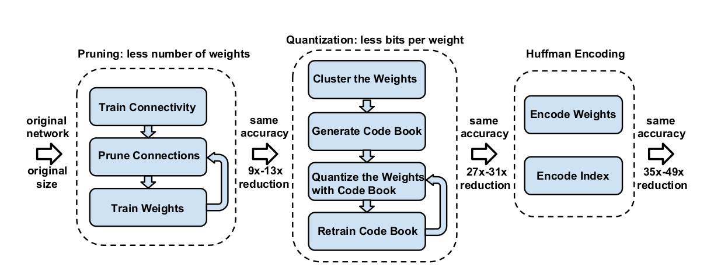

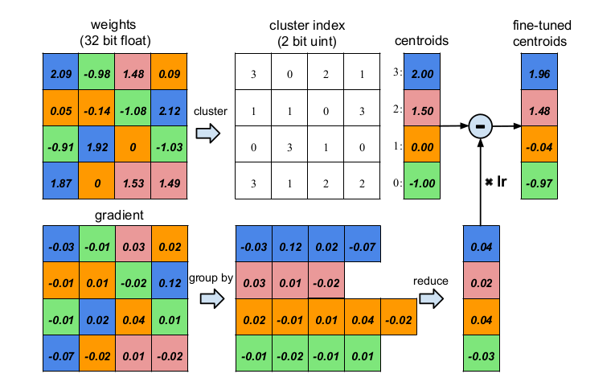

上图中训练时，4种颜色对应四个不同的权值，所以可以大大减少量化bit数。卷积层可以到8bit，全连接层可以到5bit。

[A Survey of Model Compression and Acceleration for Deep Neural Networks](https://arxiv.org/abs/1710.09282)

### 基于核的稀疏化方法

核的稀疏化，是在训练过程中，对权重的更新加以正则项进行诱导，使其更加稀疏，使大部分的权值都为0。核的稀疏化方法分为regular和irregular，regular的稀疏化后，裁剪起来更加容易，尤其是对im2col的矩阵操作，效率更高；而irregular的稀疏化后，参数需要特定的存储方式，或者需要平台上稀疏矩阵操作库的支持

- Learning Structured Sparsity in Deep Neural Networks [论文地址](./模型压缩加速/Learning Structured Sparsity in Deep Neural Networks.pdf) 

本文作者提出了一种Structured Sparsity Learning的学习方式，能够学习一个稀疏的结构来降低计算消耗，所学到的结构性稀疏化能够有效的在硬件上进行加速。 传统非结构化的随机稀疏化会带来不规则的内存访问，因此在GPU等硬件平台上无法有效的进行加速。 作者在网络的目标函数上增加了group lasso的限制项，可以实现filter级与channel级以及shape级稀疏化。所有稀疏化的操作都是基于下面的loss func进行的，其中Rg为group lasso： 
$$
E ( W ) = E _ { D } ( W ) + \lambda \cdot R ( W ) + \lambda _ { g } \cdot \sum _ { i = 1 } ^ { L } R _ { g } \left( w ^ { ( l ) } \right)
$$
则filter-channel wise： 

由于在GEMM中将weight tensor拉成matrix的结构，因此可以通过将filter级与shape级的稀疏化进行结合来将2D矩阵的行和列稀疏化，再分别在矩阵的行和列上裁剪掉剔除全为0的值可以来降低矩阵的维度从而提升模型的运算效率。该方法是regular的方法，压缩粒度较粗，可以适用于各种现成的算法库，但是训练的收敛性和优化难度不确定。

作者的源码为：https://github.com/wenwei202/caffe/tree/scnn

- Dynamic Network Surgery for Efficient DNNs [论文地址](./模型压缩加速/Dynamic Network Surgery for Efficient DNNs.pdf) 

作者提出了一种动态的模型裁剪方法，包括以下两个过程：pruning和splicing，其中pruning就是将认为不中要的weight裁掉，但是往往无法直观的判断哪些weight是否重要，因此在这里增加了一个splicing的过程，将哪些重要的被裁掉的weight再恢复回来，类似于一种外科手术的过程，将重要的结构修补回来，它的算法如下： 

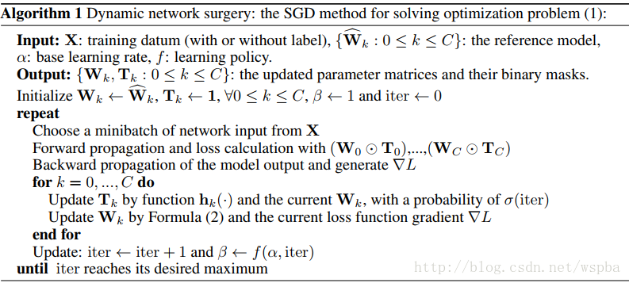

作者通过在W上增加一个T来实现，T为一个2值矩阵，起到的相当于一个mask的功能，当某个位置为1时，将该位置的weight保留，为0时，裁剪。在训练过程中通过一个可学习mask将weight中真正不重要的值剔除，从而使得weight变稀疏。由于在删除一些网络的连接，会导致网络其他连接的重要性发生改变，所以通过优化最小损失函数来训练删除后的网络比较合适。 
该算法采取了剪枝与嫁接相结合、训练与压缩相同步的策略完成网络压缩任务。通过网络嫁接操作的引入，避免了错误剪枝所造成的性能损失，从而在实际操作中更好地逼近网络压缩的理论极限。属于irregular的方式，但是ak和bk的值在不同的模型以及不同的层中无法确定，并且容易受到稀疏矩阵算法库以及带宽的限制。
论文源码：https://github.com/yiwenguo/Dynamic-Network-Surgery

- Training Skinny Deep Neural Networks with Iterative Hard Thresholding Methods 论文地址 

作者想通过训练一个稀疏度高的网络来降低模型的运算量，通过在网络的损失函数中增加一个关于W的L0范式可以降低W的稀疏度，但是L0范式就导致这是一个N-P难题，是一个难优化求解问题，因此作者从另一个思路来训练这个稀疏化的网络。算法的流程如下

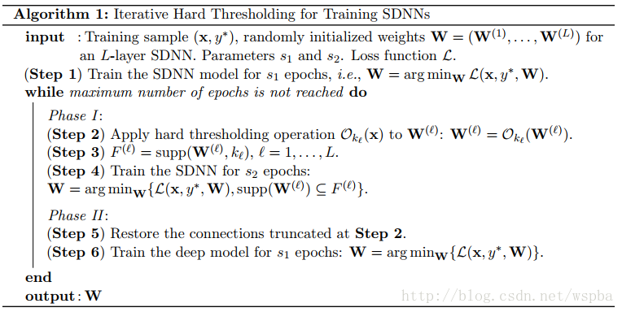

先正常训练网络s1轮，然后Ok(W)表示选出W中数值最大的k个数，而将剩下的值置为0，supp(W,k)表示W中最大的k个值的序号，继续训练s2轮，仅更新非0的W，然后再将之前置为0的W放开进行更新，继续训练s1轮，这样反复直至训练完毕。 同样也是对参数进行诱导的方式，边训练边裁剪，先将认为不重要的值裁掉，再通过一个restore的过程将重要却被误裁的参数恢复回来。也是属于irregular的方式，边训边裁，性能不错，压缩的力度难以保证。

### 基于模型裁剪的方法

对以训练好的模型进行裁剪的方法，是目前模型压缩中使用最多的方法，通常是寻找一种有效的评判手段，来判断参数的重要性，将不重要的connection或者filter进行裁剪来减少模型的冗余。同样也分为regular和irregular的方式。 这类方法最多，下面列举几篇典型的方案。

- Pruning Filters for Efficient Convnets [论文地址](./模型压缩加速/Pruning Filters for Efficient Convnets.pdf) 

作者提出了基于量级的裁剪方式，用weight值的大小来评判其重要性，对于一个filter，其中所有weight的绝对值求和，来作为该filter的评价指标，将一层中值低的filter裁掉，可以有效的降低模型的复杂度并且不会给模型的性能带来很大的损失，算法流程如下：

作者在裁剪的时候同样会考虑每一层对裁剪的敏感程度，作者会单独裁剪每一层来看裁剪后的准确率。对于裁剪较敏感的层，作者使用更小的裁剪力度，或者跳过这些层不进行裁剪。目前这种方法是实现起来较为简单的，并且也是非常有效的，它的思路非常简单，就是认为参数越小则越不重要。

- Network Trimming: A Data-Driven Neuron Pruning Approach towards Efficient Deep Architectures [论文地址](./模型压缩加速/Network Trimming: A Data-Driven Neuron Pruning Approach towards Efficient Deep Architectures.pdf) 

作者认为，在大型的深度学习网络中，大部分的神经元的激活都是趋向于零的，而这些激活为0的神经元是冗余的，将它们剔除可以大大降低模型的大小和运算量，而不会对模型的性能造成影响，于是作者定义了一个量APoZ（Average Percentage of Zeros）来衡量每一个filter中激活为0的值的数量，来作为评价一个filter是否重要的标准。APoZ定义如下： 

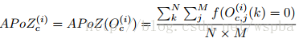

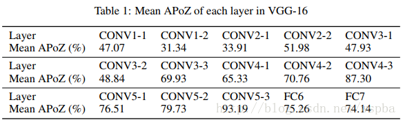

作者发现在VGG-16中，有631个filter的APoZ超过了90%，也就说明了网络中存在大量的冗余。作者的裁剪方式如下： 

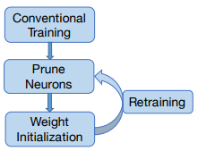

但是作者仅在最后一个卷积层和全连接层上进行了实验，因此该方法在实际中的效果很难保证。

- An Entropy-based Pruning Method for CNN Compression [论文地址](./模型压缩加速/An Entropy-based Pruning Method for CNN Compression.pdf) 

作者认为通过weight值的大小很难判定filter的重要性，通过这个来裁剪的话有可能裁掉一些有用的filter。因此作者提出了一种基于熵值的裁剪方式，利用熵值来判定filter的重要性。 作者将每一层的输出通过一个Global average Pooling将feature map转换为一个长度为c（filter数量）的向量，对于n张图像可以得到一个n*c的矩阵，对于每一个filter，将它分为m个bin，统计每个bin的概率，然后计算它的熵值 利用熵值来判定filter的重要性，再对不重要的filter进行裁剪。第j个feature map熵值的计算方式如下： 

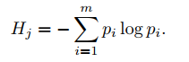

在retrain中，作者使用了这样的策略，即每裁剪完一层，通过少数几个迭代来恢复部分的性能，当所有层都裁剪完之后，再通过较多的迭代来恢复整体的性能，作者提出，在每一层裁剪过后只使用很少的训练步骤来恢复性能，能够有效的避免模型进入到局部最优。作者将自己的retrain方式与传统的finetuning方式进行比较，发现作者的方法能够有效的减少retrain的步骤，并也能达到不错的效果。 
在VGG16上作者的裁剪方式和结果如下，由于作者考虑VGG-16全连接层所占的参数量太大，因此使用GAP的方式来降低计算量： 

- Designing Energy-Efficient Convolutional Neural Networks using Energy-Aware Pruning [论文地址](https://arxiv.org/pdf/1611.05128.pdf) 

这篇文章也是今年的CVPR，作者认为以往的裁剪方法，都没有考虑到模型的带宽以及能量的消耗，因此无法从能量利用率上最大限度的裁剪模型，因此提出了一种基于能量效率的裁剪方式。 作者指出一个模型中的能量消耗包含两个部分，一部分是计算的能耗，一部分是数据转移的能耗，在作者之前的一片论文中（与NVIDIA合作，Eyeriss），提出了一种估计硬件能耗的工具，能够对模型的每一层计算它们的能量消耗。然后将每一层的能量消耗从大到小排序，对能耗大的层优先进行裁剪，这样能够最大限度的降低模型的能耗，对于需要裁剪的层，根据weight的大小来选择不重要的进行裁剪，同样的作者也考虑到不正确的裁剪，因此将裁剪后模型损失最大的weight保留下来。 

- Coarse Pruning of Convolutional Neural Networks with Random Masks 论文地址 

此文的方法比较有意思，作者认为，既然我无法直观上的判定filter的重要性，那么就采取一种随机裁剪的方式，然后对于每一种随机方式统计模型的性能，来确定局部最优的裁剪方式。 这种随机裁剪方式类似于一个随机mask，假设有M个潜在的可裁剪weight，那么一共就有2^M个随机mask。假设裁剪比例为a，那么每层就会随机选取ML*a个filter，一共随机选取N组组合，然后对于这N组组合，统计裁剪掉它们之后模型的性能，然后选取性能最高的那组作为局部最优的裁剪方式。可能需要尝试多个mask才能得到较好的结果。

- Efficient Gender Classification Using a Deep LDA-Pruned Net [论文地址](https://arxiv.org/pdf/1704.06305.pdf) 

作者发现，在最后一个卷积层中，经过LDA分析发现对于每一个类别，有很多filter之间的激活是高度不相关的，因此可以利用这点来剔除大量的只具有少量信息的filter而不影响模型的性能。 作者在VGG-16上进行实验，VGG-16的conv5_3具有512个filter，将每一个filter的输出值中的最大值定义为该filter的fire score，因此对应于每一张图片就具有一个512维的fire向量，当输入一堆图片时，就可以得到一个N*512的fire矩阵，作者用intra-class correlation来衡量filter的重要性

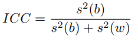

具体实现如下： 

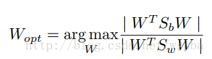

其中： 

Sw为类内距离，Sb为类间距离，作者这样做的目的是通过只保留对分类任务提取特征判别性最强的filter，来降低模型的冗余。 在前面几个卷积层，由于提取的特征都是很简单的特征，如边缘、颜色，直接对它们求ICC可能难以达到好的效果，因此作者在这些层之后接了deconv层，将特征映射到pixel级别，再来计算。 对于VGG最后用来分类的全连接层，作者认为参数量太大，故用Bayesian或者SVM来替代，在目前的ResNet或者Inception中不存在这样的问题，可以不用考虑。在VGG16上，本文方法裁剪的力度还是比较大的，但是本文作者做的任务为性别识别，在其他任务中的效果未知。 

- Sparsifying Neural Network Connections for Face Recognition [论文地址](http://www.cv-foundation.org/openaccess/content_cvpr_2016/papers/Sun_Sparsifying_Neural_Network_CVPR_2016_paper.pdf) 

本文为2016年的CVPR，应用场景为人脸识别的模型：DeepID。作者认为，如果一层中的某个神经元的激活与上一层的某个神经元的激活有很强的相关性，那么这个神经元对于后面层的激活具有很强的判别性。也就是说，如果前后两层中的某对神经元的激活具有较高的相关性，那么它们之间的连接weight就是非常重要的，而弱的相关性则代表低的重要性。如果某个神经元可以视为某个特定视觉模式的探测器，那么与它正相关的神经元也提供了这个视觉模式的信息，而与它负相关的神经元则帮助减少误报。作者还认为，那些相关性很低的神经元对，它们之间的连接不一定是一点用也没有，它们可能是对于高相关性神经元对的补充。在全连接层中，计算方式如下：

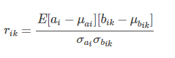

其中 ai 是当前层的一个神经元，上一层有 K 个神经元，为bik。 
卷积层的计算方式如下： 

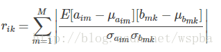

其中 aim 是当前层第 i 个feature map中的第 m 神经元，bmk 应该是上一层 feature map 中与aim连接的神经元。 
本文的算法流程如下： 

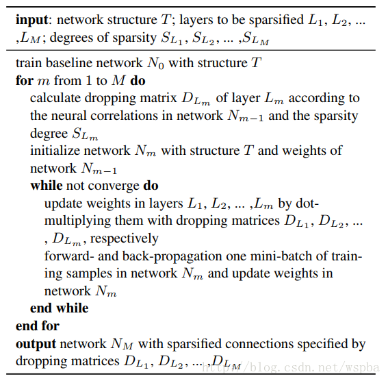

作者提供了一个基于神经元激活相关性的重要性判别方法，属于irregular的方法，在计算公式上增加一个求和项可以将这种方法拓展到filter级上。但是作者在实验中并没有对所有的层进行裁剪来比较效果，但是在人脸识别任务上的效果确实是非常好。

- Pruning Convolutional Neural Networks for Resource Efficient Transfer Learning Inference [论文地址](http://jankautz.com/publications/Pruning_ICLR17.pdf) 

本文为今年的ICLR，Nvidia的工作，作者将裁剪问题当做一个组合优化问题：从众多的权重参数中选择一个最优的组合B，使得被裁剪的模型的代价函数的损失最小，即： 

这类似于Oracle pruning的方式，即通过将每一个weight单独的剔除后看模型损失函数的衰减，将衰减最少的参数认为是不重要的参数，可以剔除，这也是OBD的思路，但是OBD的方法需要求二阶导数，实现起来难度较大，而本文提出的Taylor expansion的方法可以很好的解决这个问题： 

本文的方法还有一个优点就是，可以在训练的反向过程中将梯度记录下来，然后与feature map的activation直接相乘，可以达到边训练边裁剪的效果。

- 总结

可以看出来，基于模型裁剪的方法很多，其思路源头都是来自于Oracle pruning 的方法，即挑选出模型中不重要的参数，将其剔除而不会对模型的效果造成太大的影响，而如何找到一个有效的对参数重要性的评价手段，在这个方法中就尤为重要，我们也可以看到，这种评价标准花样百出，各有不同，也很难判定那种方法更好。在剔除不重要的参数之后，通过一个retrain的过程来恢复模型的性能，这样就可以在保证模型性能的情况下，最大程度的压缩模型参数及运算量。目前，基于模型裁剪的方法是最为简单有效的模型压缩方式。

### 基于精细模型设计的方法

很多工作将注意力放在更小、更高效、更精细的网络模块设计上，如SqueezeNet的fire module，ResNet的Residual module，GoogLenet的Inception Module，它们基本都是由很小的卷积（1*1和3*3）组成，不仅参数运算量小，同时还具备了很好的性能效果。

- MobileNets: Efficient Convolutional Neural Networks for Mobile Vision Applications 论文地址 

这篇论文是Google针对手机等嵌入式设备提出的一种轻量级的深层神经网络，取名为MobileNets。核心思想就是卷积核的巧妙分解，可以有效减少网络参数。所谓的卷积核分解，实际上就是将a × a × c分解成一个a × a × 1的卷积和一个1 ×1 × c的卷积，，其中a是卷积核大小，c是卷积核的通道数。其中第一个a × a × 1的卷积称为Depthwise Separable Convolutions，它对前一层输出的feature map的每一个channel单独进行a × a 的卷积来提取空间特征，然后再使用1 ×1 的卷积将多个通道的信息线性组合起来，称为Pointwise Convolutions，如下图： 

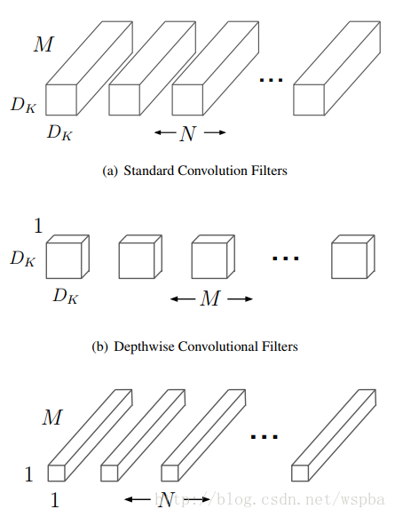

这样可以很大程度的压缩计算量： 

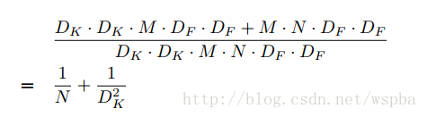

其中DK为原始卷积核的大小，DF为输入feature map的尺寸， 这样相当于将运算量降低DK^2倍左右。 
MobileNet中Depthwise实际上是通过卷积中的group来实现的，其实在后面也会发现，这些精细模型的设计都是和group有关。本文的源码：https://github.com/shicai/MobileNet-Caffe

- Aggregated Residual Transformations for Deep Neural Networks [论文地址](https://arxiv.org/pdf/1611.05431.pdf) 

作者提出，在传统的ResNet的基础上，以往的方法只往两个方向进行研究，一个深度，一个宽度，但是深度加深，模型训练难度更大，宽度加宽，模型复杂度更高，计算量更大，都在不同的程度上增加了资源的损耗，因此作者从一个新的维度：Cardinality（本文中应该为path的数量）来对模型进行考量，作者在ResNet的基础上提出了一种新的结构，ResNeXt： 

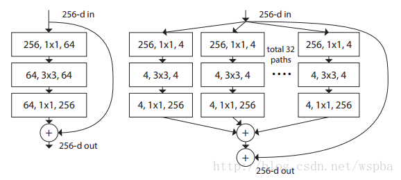

上图中两种结构计算量相近，但是右边结构的性能更胜一筹（Cardinality更大）。 

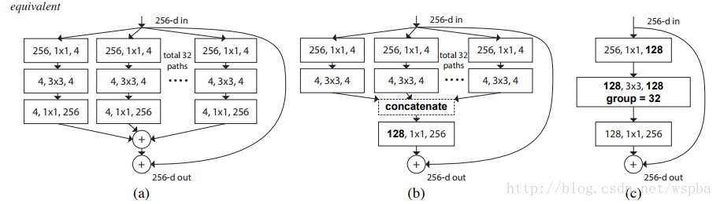

以上三种结构等价，因此可以通过group的形式来实现ResNeXt。其实ResNeXt和mobilenet等结构性质很相近，都是通过group的操作，在维度相同时降低复杂度，或者在复杂度相同时增加维度，然后再通过1*1的卷积将所有通道的信息再融合起来。因此全文看下来，作者的核心创新点就在于提出了 aggregrated transformations，用一种平行堆叠相同拓扑结构的blocks代替原来 ResNet 的三层卷积的block，在不明显增加参数量级的情况下提升了模型的准确率，同时由于拓扑结构相同，超参数也减少了，便于模型移植。本文的源码：https://github.com/facebookresearch/ResNeXt

- ShuffleNet: An Extremely Efficient Convolutional Neural Network for Mobile Devices [论文地址](https://arxiv.org/abs/1707.01083?context=cs.CV) 

作者提出，虽然MobileNet、ResNeXt等网络能够大大的降低模型的复杂度，并且也能保持不错的性能，但是1 ×1卷积的计算消耗还是比较大的，比如在ResNeXt中，一个模块中1 ×1卷积就占据了93%的运算量，而在MobileNet中更是占到了94.86%，因此作者希望在这个上面进一步降低计算量：即在1 ×1的卷积上也采用group的操作，但是本来1 ×1本来是为了整合所有通道的信息，如果使用group的操作就无法达到这个效果，因此作者就想出了一种channel shuffle的方法，如下图： 

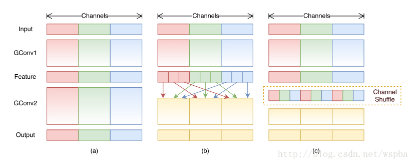

如上图b和c，虽然对1 ×1的卷积使用了group的操作，但是在中间的feature map增加了一个channel shuffle的操作，这样每个group都可以接受到上一层不同group的feature，这样就可以很好的解决之前提到的问题，同时还降低了模型的计算量，ShuffleNet的模块如下： 

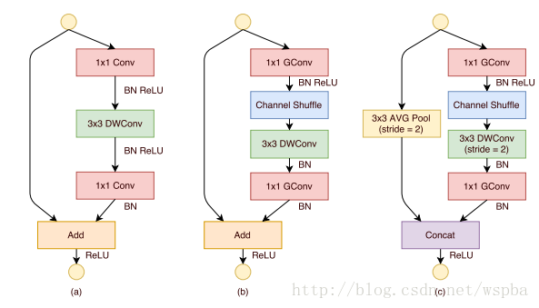

作者使用了不同的group数进行实验，发现越小的模型，group数量越多性能越好。这是因为在模型大小一样的情况下，group数量越多，feature map的channel数越多，对于小的模型，channel数量对于性能提升更加重要。 
最后作者将shufflenet的方法和mobilenet的方法进行了比较，性能似乎更胜一筹：

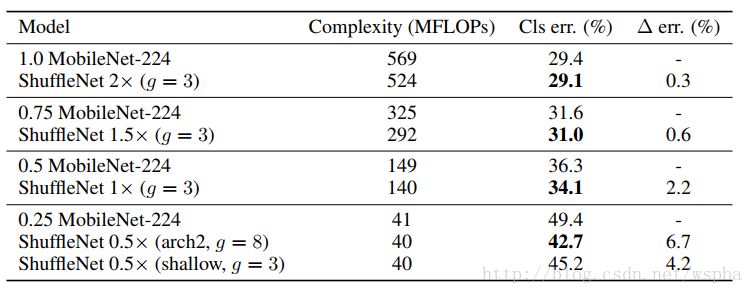

- 小结：

本节的三篇论文都是对精细模型的设计方法，直接搭建出参数运算量小的模型，适用于嵌入式平台，基本上都是通过group的方式来实现，确实能够很大程度的将模型的计算量降到最低，尤其是最后一篇shufflenet，实际上利用了一个特征融合的思路，在一个下模型中，分为更细的模型（group），再将这些更细的模型有效的融合起来，能够充分的利用参数，而达到更好的压缩效果。

### 低秩分解

关于张量分解的回顾可以在[这里](http://www.sandia.gov/~tgkolda/pubs/pubfiles/TensorReview.pdf)找到。Tensorly的作者也写了于Tensor的基础内容[非常棒的notebook](https://github.com/JeanKossaifi/tensorly-notebooks)。

CNN基本包括以下一些Layer：conv /bn / action /pool /fc 等。其中pool/action 层正常是没有参数的；因此，我们所说的关于CNN网络的压缩主要是指针对conv 和 fc而言。

网络压缩的目的是：1 提高运行时间效率；2 降低模型空间存储大小；

对于CNN网络来说：1 网络参数的90%来源于全连接层；2 网络运行时间的90%来源于卷积层；3 卷积层的时间大部分都消耗在前面几层（

[Exploiting Linear Structure Within Convolutional Networks for Efficient Evaluation](./模型压缩加速/Exploiting Linear Structure Within Convolutional Networks for Efficient Evaluation.pdf)   2014年）。

关于卷积的参数量和运算时间可参考如下图所示：

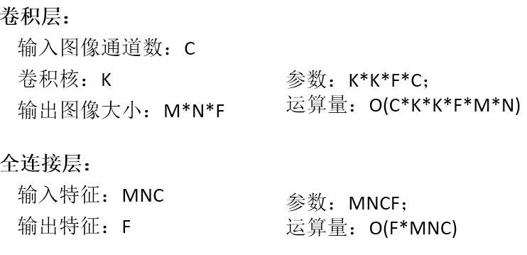

**总结：**低秩逼近的方法用于全连接层效果较好，但是对运行时间提升空间不是很大。一般能达到1.5倍。将低秩逼近的压缩算法用于卷积层时，会出现误差累积的效果，对最后精度损失影像较大，需要对网络进行逐层的微调，费时费力。

原理：权值向量主要分布在一些低秩子空间，用少数基来重构权值矩阵

参考： [(ICCV 2017) Coordinating Filters for Faster Deep Neural Networks](./模型压缩加速/低秩分解/Coordinating Filters for Faster Deep Neural Networks.pdf)           [GitHub](https://github.com/wenwei202/caffe)

#### SVD分解

在Fast-RNN论文中，Ross Girshick使用它来加速用于检测的全连接层。代码可以在这里找到：[pyfaster-rcnn implementation](https://github.com/rbgirshick/py-faster-rcnn/blob/master/tools/compress_net.py)。

#### CP 分解( Canonical Polyadic Decomposition (CPD)

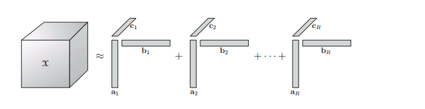

CP分解的知识点可参看大佬博客：[CP分解](http://www.xiongfuli.com/%E6%9C%BA%E5%99%A8%E5%AD%A6%E4%B9%A0/2016-06/tensor-decomposition-cp.html)

 **使用微调CP分解加速卷积神经网络**

[*1412.6553 Speeding-up Convolutional Neural Networks Using Fine-tuned CP-Decomposition*](https://arxiv.org/abs/1412.6553) 这篇论文说明了如果CP分解能够用于卷积层的加速。

**用PyTorch和Tensorly卷积层CP分解**

#### TD 分解( Tucker Decomposition )

Tucker分解是一种高阶的主成分分析，它将一个张量表示成一个核心（core）张量沿每一个mode乘上一个矩阵。 

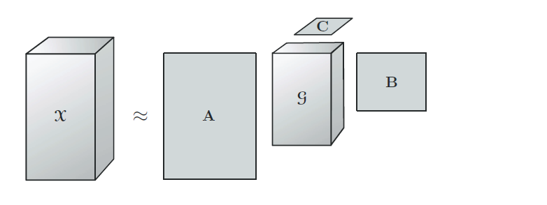

 内容可参看大佬博客：[张量分解-Tucker分解](http://www.xiongfuli.com/%E6%9C%BA%E5%99%A8%E5%AD%A6%E4%B9%A0/2016-06/tensor-decomposition-tucker.html)

**用于快速和低功率移动应用的深度卷积神经网络的压缩**

[1511.06530 Compression of Deep Convolutional Neural Networks for Fast and Low Power Mobile Applications ](https://arxiv.org/abs/1511.06530)这一篇非常酷的论文，说明了如何使用Tucker分解来加速卷积层来得到更好的结果。

Tucker分解也称为高阶奇异值分解（HOSVD）或者其他名称，是对张量进行奇异值分解的一种推广。

**用PyTorch和Tensorly卷积层Tucker分解**

#### BTD 分解（block term decomposition）

BTD的内容可参考大佬博客：[BTD分解](http://www.xiongfuli.com/%E6%9C%BA%E5%99%A8%E5%AD%A6%E4%B9%A0/2017-06/tensor-decomposition-BTD.html)

