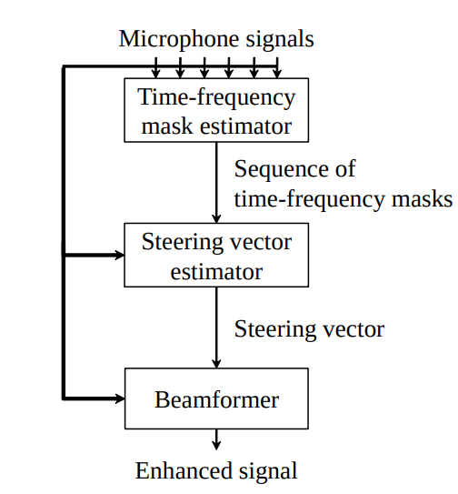

# cgmmmvdr
<!-- toc -->
## 参考文献：
ROBUST MVDR BEAMFORMING USING TIME-FREQUENCY MASKS FOR ONLINE/OFFLINE ASR IN NOISE，Takuya Higuchi, Nobutaka Ito, Takuya Yoshioka and Tomohiro Nakatani
## 综述

  结构示意图如下： 

### beamforming
$$\mathbf{y}_{f,t}=[y_{f,t,1},\cdots,y_{f,t,M}]^{T}$$
其中 $$f,t$$ 是频时点，一共M个麦克风。

$$\widehat{s}_{f,t}=\mathbf{w}^{\mathrm{H}}_{f}\mathbf{y}_{f,t}$$
其中$$\mathbf{w}_{f}$$是使$$\mathbf{w}^{\mathrm{H}}_{f}\mathbf{r}_{f}=1$$的beamformer，其中$$\mathbf{r}_{f}$$是信号的导向矢量。
### 导向矢量估计

$$\mathcal{R}_{f}^{(x+n)}=\frac{1}{T} \sum \limits_{t} \mathbf{y}_{f,t} \mathbf{y}_{f,t}^{\mathrm{H}}$$

$$\mathcal{R}_{f}^{(n)}=\frac{1}{\sum_{t}\lambda_{f,t}^{(n)}} \sum \limits_{t} \lambda_{f,t}^{(n)} \mathbf{y}_{f,t} \mathbf{y}_{f,t}^{\mathrm{H}}$$

可以求得需要的协方差阵

$$\mathcal{R}_{f}^{(x)}=\mathcal{R}_{f}^{(x+n)}-\mathcal{R}_{f}^{(n)}$$

## 基于CGMM(复高斯混合模型)的时频掩蔽估计
### 时频掩蔽观察模型
$$
\mathbf{y}_{f,t}=\mathbf{r}_{f}^{({v})}s_{f,t}^{v} (\mathbf{where}\ d_{f,t}={v})
$$

$${v}$$包含了$$x+n$$或者$$n$$。
$$s_{f,t}^{(x+n)}$$表示混合了语音信号和噪声；$$s_{f,t}^{(n)}$$表示噪声。
$$\mathbf{r}_{f}^{{v}}$$表示导向矢量。

### CGMM的生成模型

$$
\mathbf{y}_{f,t} | d_{f,t} = v \sim \mathcal{N}_{c}(0,\phi_{f,t}^{(v)}\mathbf{R}_{f}^{(v)})
$$
其中$$\mathbf{R}_{f}^{(v)}=\mathbf{r}_{f}^{(v)}\mathbf{r}_{f}^{(v)\mathrm{H}}$$，$$\phi_{f,t}^{(v)}$$对应时频位置的协方差。
### 基于EM算法的参数估计
CGMM参数有$$\phi_{f,t}^{(v)}$$和$$\mathbf{R}_{f}^{(v)}$$。
$$
\lambda_{f,t}^{(v)}\leftarrow \frac{p(\mathbf{y}_{f,t}|d_{f,t}=v)}{\sum_{v}p(\mathbf{y}_{f,t}|d_{f,t}=v)}
$$
参数更新如下式，直到$$\lambda_{f,t}^{(n)}$$收敛：
$$
\phi_{f,t}^{(v)}\leftarrow \frac{1}{M}\mathrm{tr}(\mathbf{y}_{f,t}\mathbf{y}_{f,t}^{\mathrm{H}}\mathbf{R}_{f}^{(v)^{-1}})
$$
$$
\mathbf{R}_{f}^{(v)}\leftarrow \frac{1}{\sum_{t}\lambda_{f,t}^{(v)}}\sum_{t}\lambda_{f,t}^{(v)}\frac{1}{\phi_{f,t}^{(v)}}\mathbf{y}_{f,t}\mathbf{y}_{f,t}^{\mathrm{H}}
$$