# Webrtc AGC 算法原理介绍

[TOC]

## 参考链接

1. https://blog.csdn.net/ssdzdk/article/details/52588415
2. https://blog.csdn.net/ssdzdk/article/details/52595850
3. https://blog.csdn.net/ssdzdk/article/details/52848161
4. https://blog.csdn.net/ssdzdk/article/details/54691463
5. https://blog.csdn.net/ssdzdk/article/details/54845646
6. https://blog.csdn.net/ssdzdk/article/details/54890086

## AGC模块的结构与简介

　　　｜–\include |–gain_control.h 
agc-    ｜–analog_agc.c 
　　　｜–analog_agc.h 
　　　｜–digital_agc.c 
　　　｜–digital_agc.h

gain_control.h是包装的头文件，在apm里头gain_control_impl调用。主要包括了接口定义函数和参数配置。 
对于该文件着预先说一下配置的含义。

```c
enum
{
    kAgcModeUnchanged,
    kAgcModeAdaptiveAnalog,
    kAgcModeAdaptiveDigital,
    kAgcModeFixedDigital
};
typedef struct
{
    int16_t targetLevelDbfs;   // default 3 (-3 dBOv)
    int16_t compressionGaindB; // default 9 dB
    uint8_t limiterEnable;     // default kAgcTrue (on)

} WebRtcAgc_config_t;
```

枚举是agc的使用模式，一个是kAgcModeAdaptiveAnalog、kAgcModeAdaptiveDigital和kAgcModeFixedDigital是常用的三种模式。kAgcModeAdaptiveAnalog带有模拟音量调节的功能。kAgcModeAdaptiveDigital是可变增益agc，但是不调节系统音量。kAgcModeFixedDigital是固定增益的agc。 
WebRtcAgc_config_t是配置targetLevelDbfs和compressionGaindB用于调节agc的动态范围。

analog_agc.h包括模拟的agc结构体声明，而gain_control.h中的接口函数在analog_agc.c中实现。

| 函数                 | 功能                                                   |
| -------------------- | ------------------------------------------------------ |
| WebRtcAgc_AddFarend  | 计算远端信号的语音活度VAD                              |
| WebRtcAgc_AddMic     | 计算麦克风输入的语音活度，对于非常小的信号会乘增益系数 |
| WebRtcAgc_VirtualMic | 用虚拟的麦克风音量来调节幅度                           |
| WebRtcAgc_Process    | vad（agc？）核心处理                                   |
| WebRtcAgc_set_config | 设置VAD（agc？）参数                                   |

另外在analog_agc.c还包括以下函数：

| 函数                          | 功能 |
| ----------------------------- | ---- |
| WebRtcAgc_UpdateAgcThresholds | 略   |
| WebRtcAgc_SaturationCtrl      | 略   |
| WebRtcAgc_ZeroCtrl            | 略   |
| WebRtcAgc_SpeakerInactiveCtrl | 略   |
| WebRtcAgc_ExpCurve            | 略   |
| WebRtcAgc_ProcessAnalog       | 略   |

digital_agc.h包括数字的agc结构体声明，Vad结构声明，而gain_control.h中的接口函数在analog_agc.c中实现。

| 函数                         | 功能 |
| ---------------------------- | ---- |
| WebRtcAgc_ProcessDigital     | 略   |
| WebRtcAgc_AddFarendToDigital | 略   |
| WebRtcAgc_InitVad            | 略   |
| WebRtcAgc_ProcessVad         | 略   |
| WebRtcAgc_CalculateGainTable | 略   |

## AGC的三个流程

| 函数                | 调用             | 功能                                                         |
| ------------------- | ---------------- | ------------------------------------------------------------ |
| ProcessRenderAudio  | 远端输出前       | 调用AGC的WebRtcAgc_AddFarend                                 |
| AnalyzeCaptureAudio | 近端高通滤波器后 | 根据模式，可变模拟（kAdaptiveAnalog）调用WebRtcAgc_AddMic，可变模拟（kAdaptiveDigital）调用WebRtcAgc_VirtualMic |
| ProcessCaptureAudio | 近端VAD后输出前  | 调用AGC的WebRtcAgc_Process                                   |

这三个流程是AGC的主要接口。下面将会对这些三个流程进行详细的介绍。

### ProcessRenderAudio

首先介绍ProcessRenderAudio，这个函数在远端调用，主要目的是分析远端信号的VAD属性。调用了AGC中的WebRtcAgc_AddFarend函数。实际上WebRtcAgc_AddFarend函数只是做了一些参数的校验，最后调用了WebRtcAgc_AddFarendToDigital，WebRtcAgc_AddFarendToDigital调用到了WebRtcAgc_ProcessVad。

```flow
st=>start: start
op1=>operation: ProcessRenderAudio(AudioBuffer* audio)
op2=>operation: WebRtcAgc_AddFarend(my_handle,mixed_data,static_cast<int16_t>(audio->samples_per_split_channel()))
op3=>operation: Check input
op4=>operation: WebRtcAgc_AddFarendToDigital(&stt->digitalAgc, &in_far[i], subFrames)
op5=>operation: WebRtcAgc_ProcessVad(&stt->vadFarend, in_far, nrSamples)
e=>end: end
st->op1->op2->op3->op4->op5->e
```

再Check input的流程中，只支持以下采样率和帧长的输入数据： 
1、8K采样率，10或者20ms长度数据，subFrames为80； 
2、16K采样率，10或者20ms长度数据，subFrames为160； 
3、32K采样率，5或者10ms长度数据，subFrames为160； 

### AnalyzeCaptureAudio

AnalyzeCaptureAudio流程主要用于分析没有经过处理的声音。根据不同模式调用了数字不同的处理。流程如下：

```flow
st=>start: start
op1=>operation: AnalyzeCaptureAudio(AudioBuffer* audio)
cond=>condition: kAdaptiveAnalog(yes) or kAdaptiveDigital(not)?
op2=>operation: WebRtcAgc_AddMic
op3=>operation: WebRtcAgc_VirtualMic
e=>end: end
st->op1->cond(yes)->op2->e
cond(no)->op3->e
```

如果是选择了kFixedDigital的AGC模式，则AnalyzeCaptureAudio不起作用。

### ProcessCaptureAudio

ProcessCaptureAudio是处理的核心，包括了AGC的重要调用WebRtcAgc_Process。除了正常的参数检测之外还有有关音量调节的流程。

```c
//...
    int err = WebRtcAgc_Process(
        my_handle,
        audio->low_pass_split_data(i),
        audio->high_pass_split_data(i),
        static_cast<int16_t>(audio->samples_per_split_channel()),
        audio->low_pass_split_data(i),
        audio->high_pass_split_data(i),
        capture_levels_[i],
        &capture_level_out,
        apm_->echo_cancellation()->stream_has_echo(),
        &saturation_warning);
//...
    capture_levels_[i] = capture_level_out;
//...
  }
  if (mode_ == kAdaptiveAnalog) {
    // Take the analog level to be the average across the handles.
    analog_capture_level_ = 0;
    for (int i = 0; i < num_handles(); i++) {
      analog_capture_level_ += capture_levels_[i];
    }
    analog_capture_level_ /= num_handles();
  }
```

capture_levels_是通过WebRtcAgc_Process计算出来，之后的analog_capture_level_=capture_levels_。同时analog_capture_level_会用在AnalyzeCaptureAudio中的WebRtcAgc_VirtualMic中，做为设置音量输入，同时计算出capture_levels_。

```flow
st=>start: start
cond=>condition: kAdaptiveAnalog(yes) or kAdaptiveDigital(no)
op1=>operation: WebRtcAgc_VirtualMic is inputed analog_capture_level_ and output capture_levels_, The capture_levels_ is not used.
op2=>operation: WebRtcAgc_Process input capture_levels_ and output analog_capture_level_. The capture_levels_ is last analog_capture_level
e=>end: end
st->cond(yes)->op2->e
cond(no)->op1->e
```

事实上这条回路由mode控制，如果选择了数字模式，WebRtcAgc_VirtualMic输入analog_capture_level_获得的capture_levels_用于做WebRtcAgc_Process的输入，但是WebRtcAgc_Process输入值写到capture_levels_后给废弃了。如果选择了模拟模式不执行WebRtcAgc_VirtualMic，那么WebRtcAgc_Process输入capture_levels_，每次更新，并且把结果保存到analog_capture_level_中。

## 各函数介绍

### WebRtcAgc_AddMic

WebRtcAgc_AddMic用在自适应模拟模式下（kAdaptiveAnalog），其流程如下： 

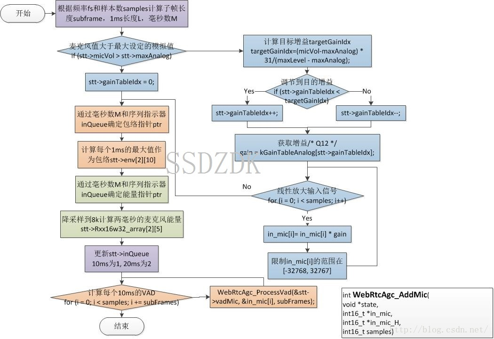

这个流程第一步是根据帧长和采样率继续分帧，具体如下：

| 采样率 | 帧长 | 子帧个数（1ms）M | 子帧长度L | subFrames |
| ------ | ---- | ---------------- | --------- | --------- |
| 8000   | 10ms | 10               | 8         | 80        |
| 8000   | 20ms | 20               | 8         | 80        |
| 16000  | 10ms | 10               | 16        | 160       |
| 16000  | 20ms | 20               | 16        | 160       |
| 32000  | 5ms  | 10               | 16        | 160       |

这里注意32k时候因为在apm里头已经做了分频，10ms的数据分成了低频16K的10ms数据和高频16k的10ms数据，因此上表32000子帧个数10和subFrames为160。这些子帧用下面用来计算能量信息。 
第二部分是如果麦克风最大值大于模拟值就计算缓慢增益的序号对应的值。 
$$
\mathrm{targetGainIdx=\frac{(GAIN\_TBL\_LEN−1)\cdots(micVol−maxAnalog)}{(maxLevel−maxAnalog)}}
$$
获取了目标放大序号后，缓慢调整放大表序号gainTableIdx，每次调整1单位。并且在kGainTableAnalog表中取出增益系数。kGainTableAnalog是Q12的，最大放大倍数是3.16倍，也就是10db。 

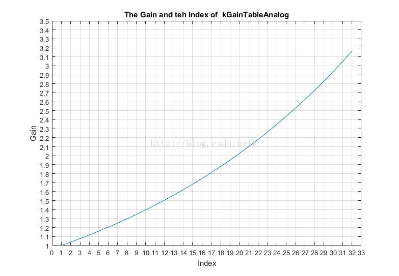

接下来这个放大倍数对输入in_mic和in_mic_H(32K)使用。 
对输入信号计算长度为L的M个子帧的最大M个能量，作为信号包络，以及M个低频8K的能量。最后对每一个subFrames计算VAD，这个为vadMic，意思是Microphone刚刚收到信号的VAD，其中包含了回声和噪声。

### WebRtcAgc_VirtualMic

从上面的流程图可以看出WebRtcAgc_VirtualMic函数在kAdaptiveDigital的时候调用。其中包括一个虚拟的音量调节部分。其详细的流程图如下: 

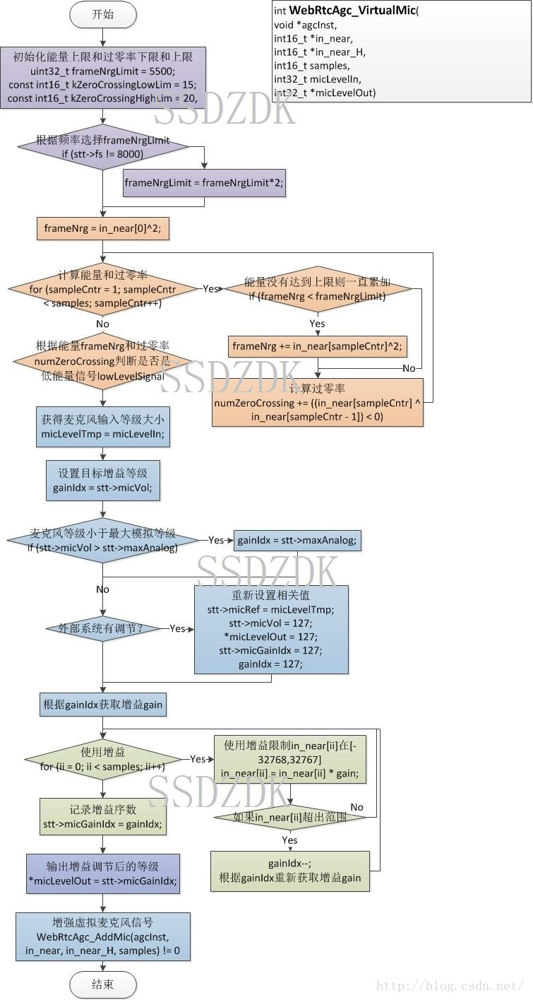

在第一个部分通过零率和能量大小来判断是否是低能信号（lowLevelSignal）。 
16KHz低信号的判决维度，其中黑色的地方是低能量lowLevelSignal = 1，白色的地方不是低能量或者说能量比较大lowLevelSignal = 0。这里能量的大小判断主要目的还是做一个VAD判决，保证处理的信号是语音而不是噪音。 

此处获得低能量信号标志在WebRtcAgc_ProcessDigital中使用，详细内容在该函数再讲述。另外一个控制模式kAgcModeAdaptiveAnalog和kAgcModeAdaptiveDigital进入WebRtcAgc_ProcessAnalog流程。

```c
//Four modes review.
enum
{
    kAgcModeUnchanged,
    kAgcModeAdaptiveAnalog,
    kAgcModeAdaptiveDigital,
    kAgcModeFixedDigital
};

if ((stt->agcMode < kAgcModeFixedDigital) && ((stt->lowLevelSignal == 0)
                || (stt->agcMode != kAgcModeAdaptiveDigital)))
{
    if (WebRtcAgc_ProcessAnalog(agcInst, inMicLevelTmp, outMicLevel,
            stt->vadMic.logRatio, echo, saturationWarning) == -1){
                return -1;
    }
}
```

```flow
st=>start: start
cond1=>condition: kAgcModeAdaptiveDigital or not?
cond2=>condition: lowLevelSignal==0?//Big signal?
op=>operation: WebRtcAgc_ProcessAnalog
e=>end: end
st->cond1(yes)->cond2(yes)->op->e
cond1(no)->op
cond2(no)->e
```

总的来说，kAgcModeAdaptiveAnalog一定进入WebRtcAgc_ProcessAnalog流程；kAgcModeAdaptiveDigital在位大能量的时候进入WebRtcAgc_ProcessAnalog流程；而kAgcModeFixedDigital不会调用该流程。 
VirtualMic的第二个流程是根据输入麦克风等级调节输入找到增益表，然后在增益表中找到对应的增益系数。 

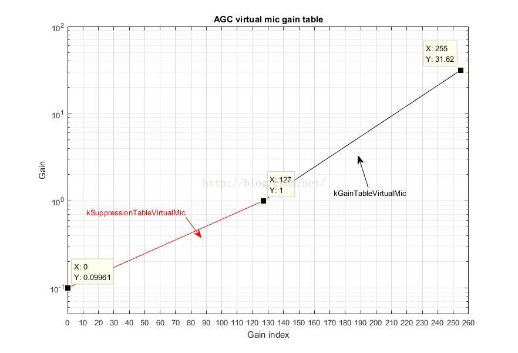

上图是增益图。可以看出随着Index，Gain指数递增。最大是31.6倍，也就是30dB放大；最小是0.0996,，也就是-20dB衰减。之所以用了两条曲线，估计是设计者认为压缩和衰减需要不同的斜率。 
确定了GainIdx的由micVol和maxAnalog以及输入的micLevelIn和micRef（micLevelIn的旧值）控制。如果在这次和上次micLevelIn有不一样的情况下，GainIdx为127。否者GainIdx=min(micVol,maxAnalog)GainIdx=min(micVol,maxAnalog)同时*micLevelOut = micGainIdx。 
最后调用WebRtcAgc_AddMic流程。

### WebRtcAgc_ProcessAnalog

WebRtcAgc_ProcessAnalog函数的作用是把输入的信号根据能量的大小，饱和标志（WebRtcAgc_StaturationCtrl），零状态(WebRtcAgc_ZeroCtrl)，以及近端语音活度(WebRtcAgc_SpeakerInactiveCtrl)的结果，来初步控制语音的大小。

#### 预处理麦克风音量

对micVol进行调节。micVol决定了模拟初步调节的音量，将处理后的音量放到本文（7、调节流程）中说的范围中去，但是这个调节必须在AddVirtualMic中通过gainIndex起作用。 
注意：在kAgcModeAdaptiveAnalog下，不调用AddVirtualMic，因此初步调节正常情况下不起作用（异常情况下回起作用）。在kAgcModeAdaptiveDigital下，GainControlImpl::set_stream_analog_level，其实不起作用，micVol起到初步调节的作用，micVol是粗调节的一个中间变量。 

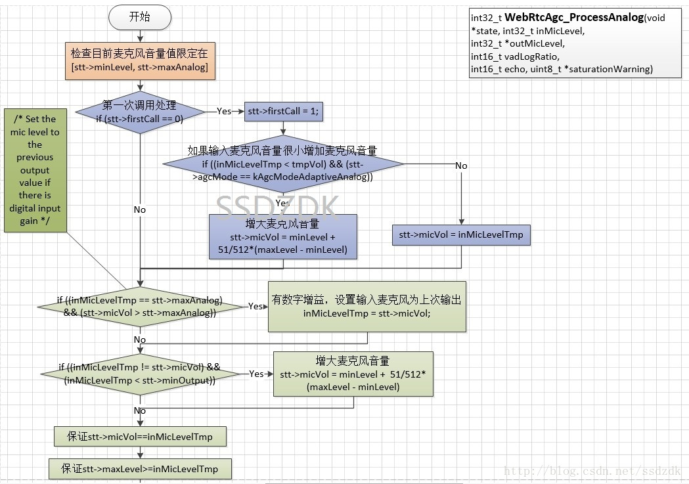


#### 检查和处理饱和

根据信号的能力包络计算信号是否饱和(WebRtcAgc_StaturationCtrl)。该函数输出了饱和标志位saturated。 
接下来根据标志位saturated来 
1)降低micVol的大小，micVol*=0.903。 
2)降低自相关系数（功率谱能量）大小，保证AGC中的VAD判决正常。 
3)设置saturationWarning输出，该标志位只在此处修改。注意：如果kAgcModeAdaptiveAnalog一定进入WebRtcAgc_ProcessAnalog流程；kAgcModeAdaptiveDigital在位大能量的时候进入WebRtcAgc_ProcessAnalog流程；而kAgcModeFixedDigital不会调用该流程。 
4)修改相关阈值。重置音量变化阈值msecSpeechInnerChange,OuterChange，改变模式changeToSlowMode，静音计数器muteGuardMs、调高界限upperLimit，调低界限lowerLimit，目的是摒除音量饱和对这些变量的影响，如果饱和，认为是不正常的语音不进行相关信息更新。降低太高标志位，目的是为了保证不要一下调低阈值。

#### 零检查

对信号的包络进行低能量检查WebRtcAgc_ZeroCtrl，判断是否是“几乎”全部为0的数据。如果是，micVol调节到一半，对数据适当放大。

#### 近端语音活度检查

对近端的语音活度检查WebRtcAgc_SpeakerInactiveCtrl。通过近端输入信号的方差来调节活度阈值vadThreshold。该阈值决定是否进入micVol和调节主流程。声音越小越难进入调节流程。 

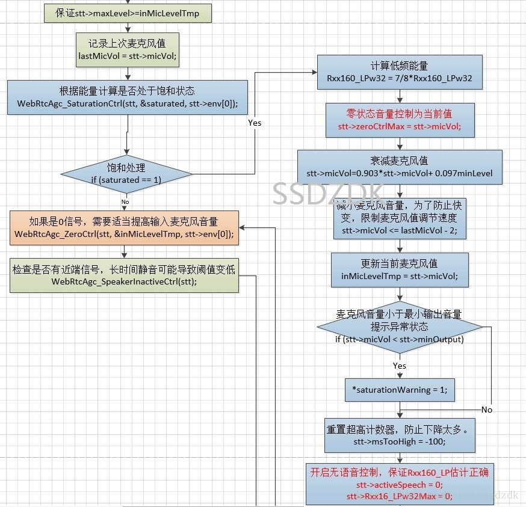

#### 计算子带能量和总能量

计算子带低频能量Rxx16_LPw32和帧能量Rxx160w32。 

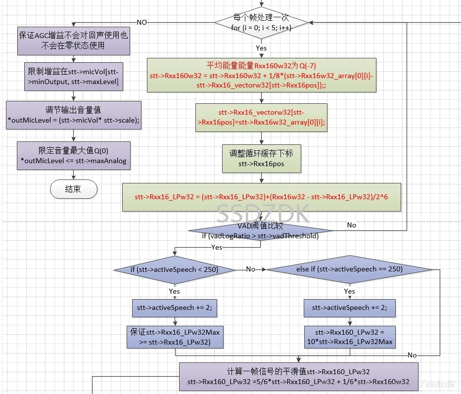

#### 根据vadMic.logRatio判断是否进入调节流程

#### 调节流程

首先计算低频的全帧能量Rxx160_LPw32。该变量根据4个阈值划分成5个界限。 
四个阈值分别是： 
1)upperSecondaryLimit 
2)upperLimit 
3)lowerLimit 
4)lowerSecondaryLimit 
这四个数值的关系是1)>2)>3)>4),其中2)可以选择startUpperLimit和upperPrimaryLimit两个阈值；3)可以选择startLowerLimit和lowerPrimaryLimit两个阈值。在区间[2),3)]中，4000ms后可以触发慢变模式（changeToSlowMode），选择lowerPrimaryLimit,upperPrimaryLimit。

| 单位（dB）          | 正常模式 | 慢变模式 |
| ------------------- | -------- | -------- |
| upperSecondaryLimit | -15      | -15      |
| upperLimit          | -19      | -18      |
| lowerLimit          | -21      | -22      |
| lowerSecondaryLimit | -25      | -25      |

下面是5个区间不同处理方法的流程图，其核心是对micVol进行调节，其目的是保证一个帧的能量在区间[2),3)]内，也即是初步调节的目的。 

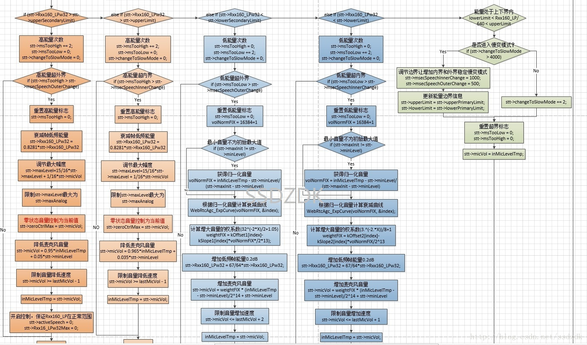

#### 检查回声，保护标志和界限

保证回声状态和静音保护过程不被放大，并且检查micVol的界限。最后micVol的值通过VirtualMic和AddMic函数起作用。

### WebRtcAgc_AddFarend

该函数调用了WebRtcAgc_AddFarToDigital函数，其中仅仅是对远端使用WebRtcAgc_ProcessVad函数。该函数的目的是计算远端信号的VAD可信度，用于在Process_Digital中使用，保证远端信号出现的地方信号增益有所减弱。这么做的原因是相信，远端信号出现出很可能出现回声信号。 
这里默认信号与近端信号已经做了延时估计对齐处理，然而在Webrtc的程序中，调用WebRtcAgc_AddFarToDigital与调用WebRtcAgc_Process处的信号显然没有严格对齐，此处存在一定的误差。

### WebRtcAgc_SaturationCtrl

该判断信号是否饱和，注意到在Webrtc_AddMic中计算了包络env的值，16khz采样的数据，10ms的数据是160个samples，分成10块，每块是16个。求每块16个点中平方值最大的点作为包络。

```c
    /* compute envelope */
    if ((M == 10) && (stt->inQueue > 0)){
        ptr = stt->env[1];
    } else{
        ptr = stt->env[0];
    }
    for (i = 0; i < M; i++){
        /* iterate over samples */
        max_nrg = 0;
        for (n = 0; n < L; n++){
            nrg = WEBRTC_SPL_MUL_16_16(in_mic[i * L + n], in_mic[i * L + n]);
            if (nrg > max_nrg){
                max_nrg = nrg;
            }
        }
        ptr[i] = max_nrg;
```

当有一块值大于-0.683dB(30290)就为envSum累加一次。如果没有累计超过25000，则算饱和。然后按照0.99的值衰减envSum。此处，如果每次包络都是0dB(32767)需要连续28块数据（相当于28ms）才饱和。如果是-0.683dB需要连续34ms才能饱和。若是小于-0.683dB永远也不能饱和了。

```c
void WebRtcAgc_SaturationCtrl(Agc_t *stt, WebRtc_UWord8 *saturated, WebRtc_Word32 *env)
{
    WebRtc_Word16 i, tmpW16;
    /* Check if the signal is saturated */
    for (i = 0; i < 10; i++){
        tmpW16 = (WebRtc_Word16)WEBRTC_SPL_RSHIFT_W32(env[i], 20);
        if (tmpW16 > 875){
            stt->envSum += tmpW16;
        }
    }
    if (stt->envSum > 25000){
        *saturated = 1;
        stt->envSum = 0;
    }
    /* stt->envSum *= 0.99; */
    stt->envSum = (WebRtc_Word16)WEBRTC_SPL_MUL_16_16_RSFT(stt->envSum,
            (WebRtc_Word16)32440, 15);
}
```

### WebRtcAgc_ZeroCtrl

该函数计算信号的大小，用msZero记数，用来控制语音活度(actgiveSpeech)和块低频能量最大值（Rxx16_LPw32Max）。这两个变量在ProcessAnalog中使用影响低频能量Rxx160_LPw32。 
具体来说，如果10ms的包络平均值小于-73.31(7)那么就算10ms的全0，msZero增加10。 
当静音时间大于500ms的时候，设置语音活度(actgiveSpeech)和块低频能量最大值（Rxx16_LPw32Max）为0（影响看前面描述）。 
并且加大输入的麦克风等级inMicLevel（实际对应硬件音量）。 
另外本函数会无条件对muteGuardMs操作。

```c
    for (i = 0; i < 10; i++){
        tmp32 += env[i];
    }
    if (tmp32 < 500){
        stt->msZero += 10;
    } else{
        stt->msZero = 0;
    }
    if (stt->muteGuardMs > 0){
        stt->muteGuardMs -= 10;
    }
    if (stt->msZero > 500){
        stt->msZero = 0;
        /* Increase microphone level only if it's less than 50% */
        midVal = WEBRTC_SPL_RSHIFT_W32(stt->maxAnalog + stt->minLevel + 1, 1);
        if (*inMicLevel < midVal) {
            /* *inMicLevel *= 1.1; */
            tmp32 = WEBRTC_SPL_MUL(1126, *inMicLevel);
            *inMicLevel = WEBRTC_SPL_RSHIFT_W32(tmp32, 10);
            /* Reduces risk of a muted mic repeatedly triggering excessive levels due
             * to zero signal detection. */
            *inMicLevel = WEBRTC_SPL_MIN(*inMicLevel, stt->zeroCtrlMax);
            stt->micVol = *inMicLevel;
        }
        stt->activeSpeech = 0;
        stt->Rxx16_LPw32Max = 0;
        /* The AGC has a tendency (due to problems with the VAD parameters), to
         * vastly increase the volume after a muting event. This timer prevents
         * upwards adaptation for a short period. */
        stt->muteGuardMs = kMuteGuardTimeMs;
    }
```

### WebRtcAgc_ExpCurve

该函数是一个曲线函数，在ProcessAnalog中调用。用于将volNormFix转换成对应的分段曲线。用于模拟指数曲线，调节音量。该函数比较简单，不再累述。

### WebRtcAgc_ProcessDigital

ProcessDigital是AGC的核心函数，无论什么模式都要调用到。现在来解释一下。 
该函数8khz的时候处理80个点的数据，16k处理160个点的数据，32k处理低频160个点的数据。每个处理都是10ms。 


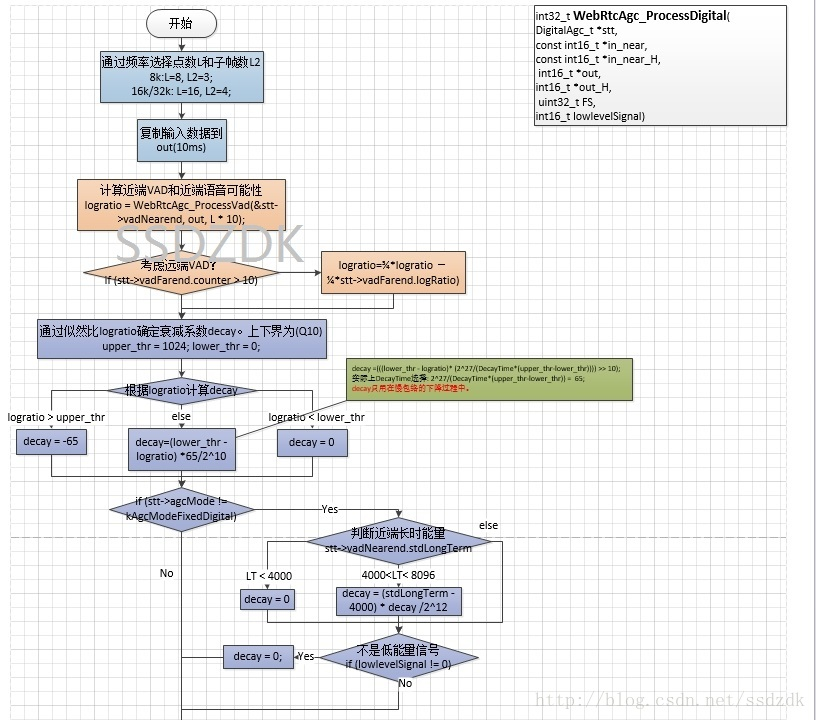

1. 首先计算了近端信号的VAD参数。并且当远端信号超过10帧（100ms）后，使用远端的VAD参数修正近端VAD，具体方法是：

$L=\frac{3}{4}L_{near}-\frac{1}{4}L_{far}$

2. 接着使用似然比L计算出衰减decay。 

$$
D_{decay}=
\left\{
\begin{matrix} 
-65,if \ L>1 \\
0,if\ L<0 \\
-65L, else
\end{matrix}
\right.
$$

如果是adaptive（无论，Analog或者Digital）中，对声音小的情况，对decay修正。这个参数在计算慢包络的时候使用。?? 

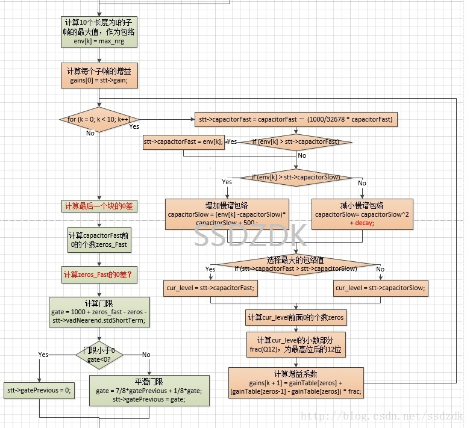

3. 计算每1ms的最大能量作为包络env。 
4. 通过快、慢包络和增益表计算出增益数组gain 

这个部分，首先计算了快慢包络。 
$$
C_{fast}=\left\{
\begin{matrix}
-1000C_{fast}+C_{fast},if\ env[k]<C_{fast} \\
env[k], if\ env[k]\geq C_{fast}
\end{matrix}
\right.
$$

$$
C_{slow}=\left\{
\begin{matrix}
C_{slow}^{2}+decay,if\ env[k]<C_{slow} \\
500(env[k]-C_{slow})+C_{slow},if\ env[k]\geq C_{slow}
\end{matrix}
\right.
$$

然后，两个包络的最大值作为$level=\max(C_{fast},C_{slow})$

最后，使用LOG2的分段线性函数把cur_level转换成gain。LOG2的整数部分是cur_level前面0的个数，如果0越少，说明数值越大，最多是31个0，最少1个0（有符号数）。小数部分用线性差值的方法，找到gain[zeros],gain[zeros-1]中间的量。 

$g[k+1]=G_{table}[zeros]+f\{G_{table}[zeros-1]-G_{table}[zeros]\}$

5. 计算门限gate 

gate意味着衰减原来的增益。gate的计算可以看成两部分，第一部分是基于

快慢包络计算出的似然比，相当于快包络与慢包络能量的倍数。第二部分是近端信号的短时方差。表达式如下： 
$$
g\approx -\log(\frac{C_{slow}}{C_{fast}})+(3.91-STD_{ST,near})
$$
先看第一部分，这里说$-\log(C_{fast})$对应于zeros_fast，这个东西是快包络大的时候它值小，$-\log(C_{slow})$对应于zeros，这个东西是慢包络大的时候它值小。第一部分说明，fast与slow包络的距离越大，也即是出现语音的可能性越大，gain越小。 

第二部分是定值减去vadNearend.stdShortTerm。无疑，语音出现可能性越大，vadNearend.stdShortTerm越大，第二部分越小，gain越小。 

计算完gain后，使用上次计算值对它平滑处理。 
$$
g=0.125g+0.875g_{old}
$$
平滑后，把门限转换成gain_adj。 
$$
g[k+1]=(1-(0.6953+g_{adj}))GT[0]+(0.6953+g_{adj})g[k+1] \\
g[k+1]=(1-\alpha_{adj})GT[0]+\alpha_{adj}g[k+1]
$$
gain_adj的值在[0, 0.304]之间，因此上公式中的$\alpha_{adj}$在[0.304,1]。 

当gate最小的时候为0（语音），gain_adj取到最大，此时不使用gainTable[0]的值作为参考； 
当gate最大的时候为2500（噪声），gain_adj取到最小，此时g[k+1]要取到相对于gainTable[0]的值的70%； 
当gate处于最大最小值之间，g[k+1]在gainTable[0]和g[k+1]确定的这条直线上移动。 
接着再根据信号的大小对gain做一些限制，保证信号不要发生剪切。 

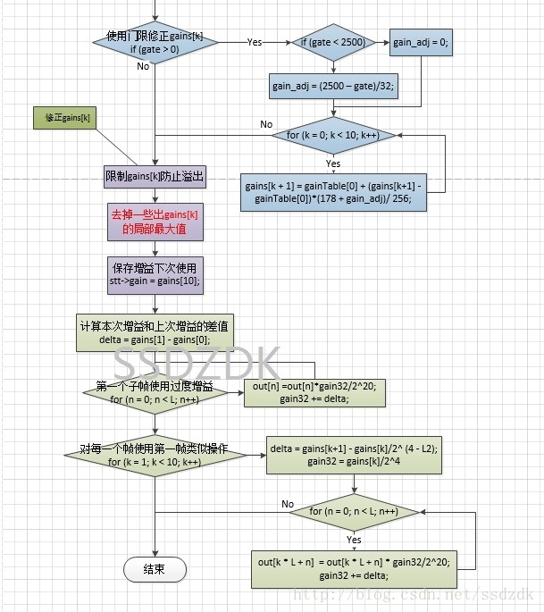

6. 使用gain 

这部分比较简单，对每一块使用不同的gain，其中每个点的gain都在两个gain[k]和gain[k+1]中差值获得。 
最后对处理后的信号进行幅度限制。