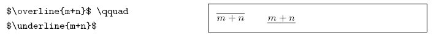
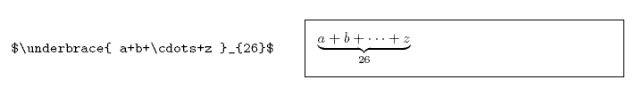
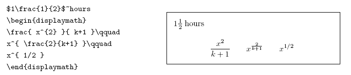
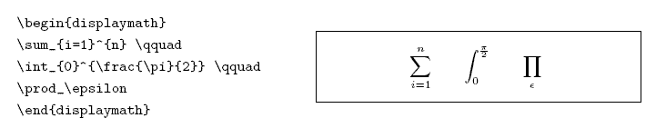

# latex常用符号

[TOC]

## 指数和下标

可以用^和_后加相应字符来实现。比如：


## 矩阵

```latex
$$
  \begin{matrix}
   1 & 2 & 3 \\
   4 & 5 & 6 \\
   7 & 8 & 9
  \end{matrix} \tag{1}
$$
```


## 平方根（square root）

输入命令为：`\sqrt`，n 次方根相应地为: `\sqrt[n]`。方根符号的大小由LATEX自动加以调整。也可用``\surd `仅给出符号


## 上下标

  一般的运算符有两种上下标形式，在latex中分别如下表示：
\bigvee_{i=1}^n    把i=1和n放到\bigvee的右下方和右上方；
\bigvee\limits_{i=1}^n   把i=1和n放到\bigvee的正下方和正上方；
\limits的作用是把i=1和n放到\bigvee的正下方和正上方；

对于非operator，不可以直接使用\limits来把上标和下标放在正上方和正下方，而需要先使用\mathop把非operator转换成operator之后再使用\limits，比如：
\cap\limits_1^n 无法编译，但如下式子可以编译：
\mathop\cap\limits__1^n

对于普通符号，比如在A上面添加1或者n，也是使用\mathop，如下：

```latex
$\mathop{A}\limits_1^n$
```

  $\mathop{A}\limits_1^n$

## 表达式的上、下方画出水平线

命令\overline 和\underline 



## 表达式的上、下方给出一水平的大括号

命令\overbrace 和\underbrace 



## 向量（Vectors）上方小箭头（arrow symbols）

这可由\vec 得到。另两个命令\overrightarrow 和\overleftarrow在定义从A 到B 的向量时非常有用


## 分数（fraction）



## 微分运算符

```$\partial$```

$\partial$


## 积分运算符

用\int 来生成。求和运算符（sum operator）由\sum 生成。乘积运算符（product operator）由\prod 生成。上限和下限用^ 和_来生成，类似于上标和下标




## 数学模式重音符&小写希腊字母&大写希腊字母


## 二元关系符&二元运算符


## 大尺寸运算符&箭头&定界符&大尺寸定界符


## 其他符号&非数学符号&AMS定界符&AMS希腊和希伯来字母


## AMS二元关系符&AMS箭头


## AMS二元否定关系符和箭头&AMS二元运算符


## AMS其他符号&数学字母

