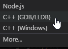
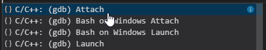
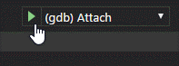

# vscode_matlab联合调试c

[TOC]

1. matlab2017b需要gcc-4.9，系统中自带的是gcc7.3
2. 安装gcc-4.8
3. `sudo update-alternatives --install /usr/bin/gcc gcc /usr/bin/gcc-4.8 40`确认gcc4.8优先级为40
4. `sudo update-alternatives --install /usr/bin/gcc gcc /usr/bin/gcc 30`确认gcc7.3优先级为30
5. `sudo update-alternatives --config gcc`选择matlab需的对应gcc版本
6. matlab中使用mex -v -g编译
7. vscode中配置调试





```
"program": "enter program name, for example ${workspaceRoot}/a.exe",
```
修改为
```
"program": "/usr/local/MATLAB/R2017b/bin/glnxa64/MATLAB",
```



点图标中attach选择matlab的进程，然后就可以愉快的联合调试了